# LangChain-Grounded Agentic Workflow Token & Cost Estimator: Architecture & Design Document

> [!IMPORTANT]
> **Executive Objective**: Traditional cloud pricing models and simple chat estimation fail when applied to enterprise agentic workflows built on **LangChain and LangGraph**. Specifically, token consumption and cloud spend are heavily dictated by the underlying orchestration topology—whether state is routed sequentially through a central **Supervisor** or fanned out concurrently across **Parallel Map-Reduce (`Send` API)** subgraphs. This design document specifies an intelligent **LangChain & LangGraph Agentic Workflow Cost Estimator** grounded in LangChain v1's core **Subagents / Router (Centralized Coordination)** pattern. It models exact state transitions across both **Sequential Supervision** and **Parallel Map-Reduce** execution modes, evaluates **Shared Global State vs. Scoped Subgraph State** token scaling, quantifies **Human-in-the-Loop (HITL) prompt cache expiration taxes**, predicts stochastic retry loops, and translates raw token metrics into finance-ready Total Cost of Ownership (TCO) and Cost per Outcome (CPO).

---

## 1. Target Audience & User Stories

### Primary Personas

| Persona | Role | Primary Goal |
| :--- | :--- | :--- |
| **SAP BTP Developer** | Builds agentic workflows that interact with SAP S/4HANA, ECC, and BTP services | Estimate per-run costs for workflows calling OData APIs, BAPIs, and RFCs |
| **Integration Architect** | Designs multi-agent patterns for ERP process automation | Compare topology options and model token costs for complex ERP integration chains |
| **IT / Engineering Manager** | Secures budget approval from Executive Management Committees | Present bulletproof business cases, ROI metrics, and worst-case budget ceilings to CFO/CIO for production deployment |
| **FinOps Analyst** | Controls and optimizes cloud costs | Generate TCO reports; identify cost-reduction opportunities across ERP-integrated AI agents |

### User Stories

1. **As an SAP BTP Developer**, I want to input my workflow topology (supervisor model, worker models calling S/4HANA OData APIs and BAPIs, state mode, tool counts) and receive a per-run cost estimate, so I can compare `Global State` vs. `Scoped Subgraph` architectures before deploying to BTP.
2. **As an Integration Architect**, I want to estimate the token cost of a Purchase Order processing agent that reads PO data from S/4HANA, validates business rules, and posts Goods Receipts — before building the workflow — so I can choose the right supervisor/worker model mix.
3. **As an IT / Engineering Manager**, I want an Executive Approval Dashboard showing Cost per Outcome (CPO), business ROI against manual processing, and a guaranteed worst-case budget ceiling, so I can present a bulletproof financial proposal to the Management Committee to approve production deployment.
4. **As a FinOps Analyst**, I want to export cost reports (CSV/PDF) and compare estimates against actual LangSmith telemetry, so I can identify token cost drift in production ERP agents and optimize spend.

---

## 2. System Architecture

### 2.1 What the Tool Is

The estimator is a **full-stack web application** deployed on **SAP Business Technology Platform (BTP)** with the following technology stack:

| Layer | Technology | Details |
| :--- | :--- | :--- |
| **Frontend** | React 18+ + MUI / TailwindCSS + React Flow | Interactive visual node graph canvas (React Flow), live token burn meters, scenario comparison, and report export. Adopts a **Titanium Slate Light Mode** aesthetic (Vercel/Linear-inspired SaaS design) with modern typography (*Inter*/*Outfit*), provider pill badges, and Recharts for data visualizations. Deployed as an HTML5 Application on SAP BTP. |
| **Backend** | SAP Cloud Application Programming Model (CAP) | Node.js-based CAP services exposing OData V4 APIs for estimation, history, and pricing management. |
| **Database** | SAP HANA Cloud | Persistent storage for estimation history, calibration data, and pricing registry via CDS-modeled entities. |
| **Authentication** | SAP BTP XSUAA | OAuth 2.0 / JWT-based authentication and role-based authorization. |
| **Deployment** | SAP BTP Cloud Foundry / Kyma | MTA (Multi-Target Application) build and deployment. |

### 2.2 Component Architecture

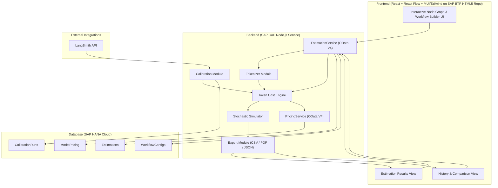

### 2.3 Data Flow

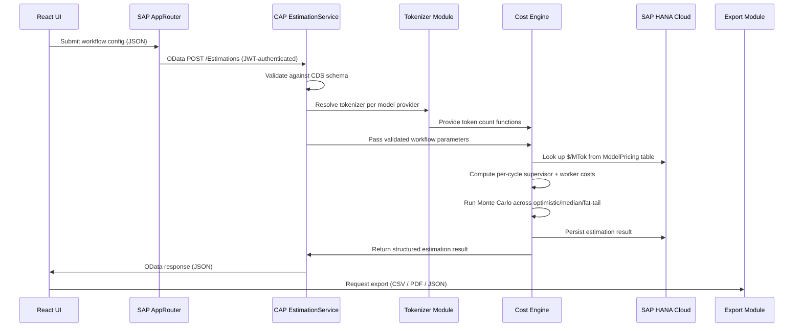

---

## 3. LangChain & LangGraph Architectural Grounding: The Subagents / Router Pattern (Centralized Coordination)

In LangChain v1 and LangGraph v1, agentic orchestration is consolidated around the **Subagents / Router** pattern (Centralized Coordination / Hub-and-Spoke). This unified pattern serves as the architectural foundation for our Cost Estimator, replacing rigid legacy classifications by combining hierarchical supervision and parallel map-reduce routing into a single, cohesive topology.

In LangGraph, a **Supervisor** coordinating subagents as tools and a **Router** dispatching tasks across parallel workers share the exact same structural foundation:
* **Central Coordinator (`Supervisor` / `Router`)**: A main agent receives the user request, maintains conversation state, makes routing/planning decisions, and delegates subtasks to specialized worker subagents or tools.
* **Worker Subagents / Tools (`Workers`)**: Specialized domain agents or tools (e.g., S/4HANA OData connectors, SQL generators, BAPI executors) that perform isolated work. To prevent context bloat, subagents execute in clean context windows or scoped subgraphs, returning their results back to the central coordinator.

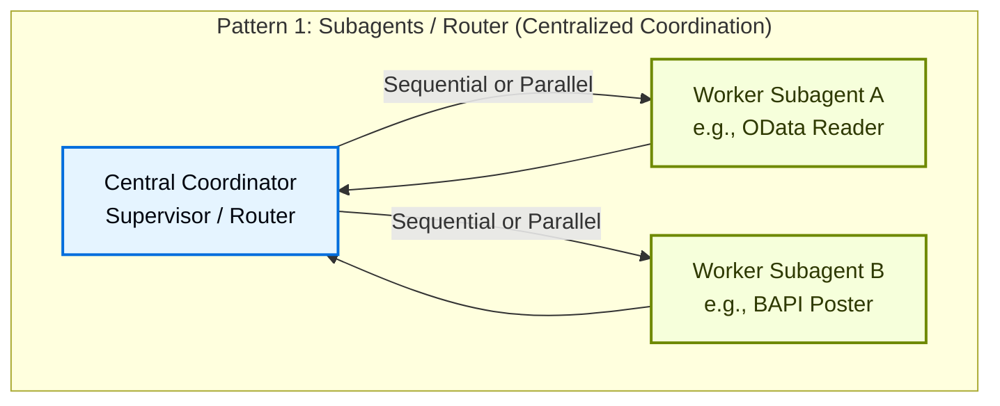

### 3.1 Two Execution Modes: Sequential Supervision vs. Parallel Map-Reduce
The behavior of the Subagents / Router pattern is governed by a single parameter knob: **Execution Mode / Parallel Fan-Out ($N_{\text{parallel}}$)**:

1. **Sequential Supervision (`sequential`, $N_{\text{parallel}} = 1$)**:
   * The central coordinator invokes workers one-by-one as tools in a multi-hop loop (e.g., *Plan $\to$ Execute Step 1 $\to$ Execute Step 2 $\to$ Synthesize*).
   * **Routing Overhead**: Incurs a supervisor evaluation token tax ($\text{Input}_{\text{sup}, m}$) at every single routing hop as results flow back through the main agent.
   * **Best For**: Complex ERP workflows requiring dynamic centralized coordination, hierarchical oversight, step-by-step reasoning, and Plan-and-Execute loops.

2. **Parallel Routing / Map-Reduce (`parallel_map_reduce`, $N_{\text{parallel}} > 1$)**:
   * The central coordinator fans out tasks concurrently across $N$ worker instances via LangGraph's `Send` API (e.g., *querying 5 SAP vendor catalogs simultaneously*), followed by a fan-in synthesis step.
   * **Routing Overhead**: Token consumption scales linearly across parallel branches ($N_{\text{parallel}} \times \text{BranchTokens}$), but wall-clock latency is governed by the maximum single-branch runtime ($\max_i \text{Latency}_i$) rather than the sum.
   * **Best For**: High-throughput batch processing, multi-vendor SAP catalog queries, and multi-domain parallel execution.

---

### 3.7 The Two State Management Topologies across Architectures
Across all six architectures, token accumulation is fundamentally governed by how graph state (`StateGraph`) is passed between nodes:

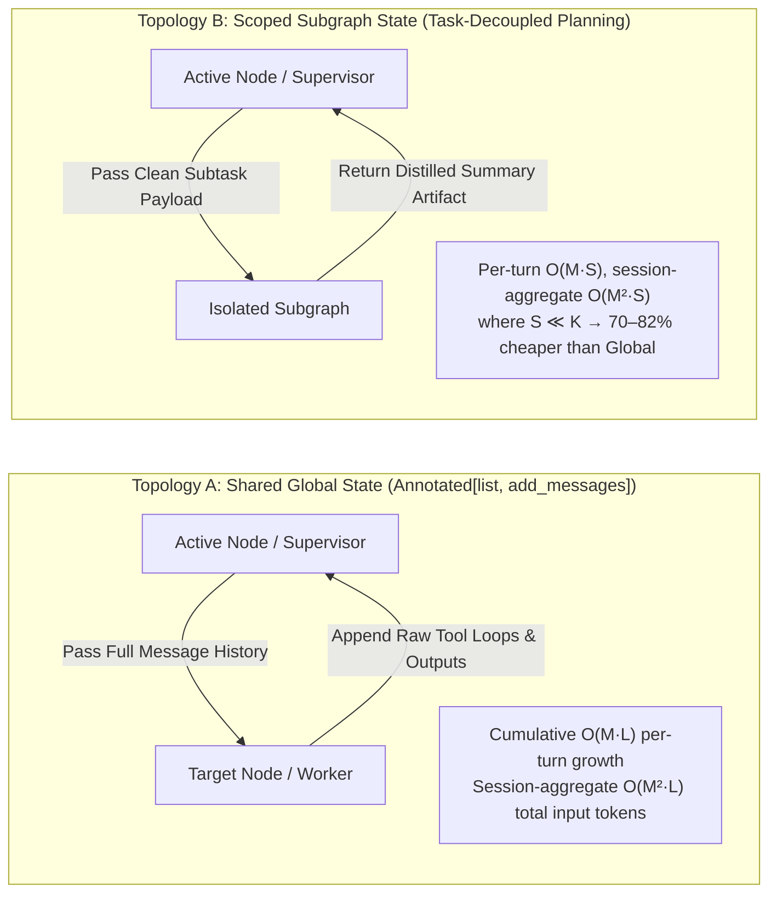

1. **Topology A: Shared Global State (`Annotated[list, add_messages]`)**:
   * All nodes read and write to a single, un-trimmed `messages` list. Every node pays input token fees to re-read all prior raw tool loops, verbose S/4HANA OData API responses, and intermediate debugging outputs.
   * **Economic Penalty**: Summed over a session of $M$ routing turns or handoffs, total input tokens scale as $O(M^2 \cdot \bar{L} \cdot K)$ — **quadratic in the number of turns**. A single verbose ERP XML/JSON payload (2,000+ tokens) snowballs rapidly across turns.
2. **Topology B: Scoped Subgraph State (Task-Decoupled Planning - TDP)**:
   * Nodes receive only isolated subtask payloads (`WorkerState`). Workers run internal ReAct loops inside isolated LangGraph subgraphs and return *only* concise summary artifacts back to the main graph state.
   * **Economic Benefit**: Session input tokens scale as $O(M^2 \cdot S)$ where $S$ is the summary artifact size ($S \ll K$). This reduces cumulative token spend by **70–82%** on multi-step benchmarks while preventing context overflow.

---

## 4. Input Parameter Schema (Formal Definition)

To model exact LangChain/LangGraph execution footprints across all six architectures, the estimator collects user parameters structured around LangChain primitives:

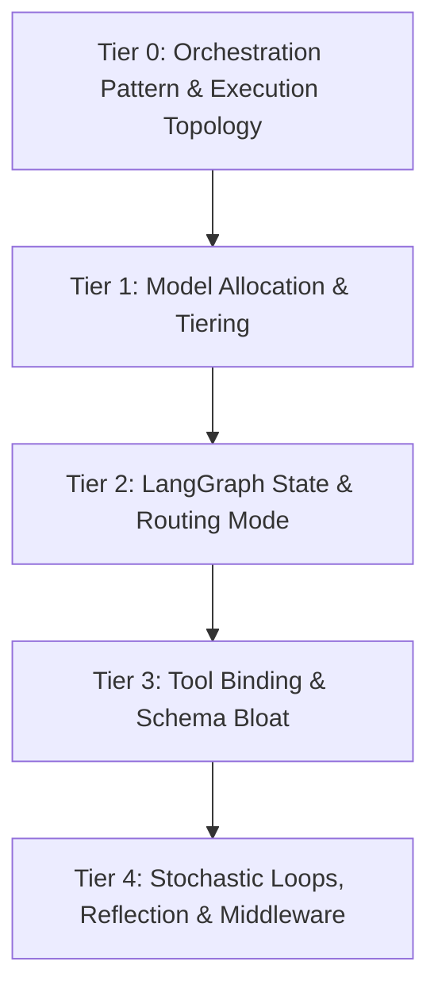

### Tier 0: The Subagents / Router Pattern & Execution Topology
Our architecture is grounded exclusively in LangChain v1's **Subagents / Router** pattern (Centralized Coordination / Hub-and-Spoke). Users configure their workflow topology by selecting the **Execution Mode** (`sequential` vs. `parallel_map_reduce`), which dynamically reconfigures the required model allocations, routing formula mechanics, and UI canvas layout.

### Tier 1: Model Allocation & Model Tiering
In LangChain, cost optimization relies heavily on assigning appropriate LLMs to distinct specialized roles:
* **Central Coordinator / Router Model ($M_{\text{sup}}$)**: Required for all workflows. Manages conversation state, makes routing/planning decisions, and delegates subtasks to workers (e.g., `GPT-4o`, `Claude 3.5 Sonnet`, or `Gemini 1.5 Pro` via SAP GenAI Hub).
* **Synthesizer / Reducer Model ($M_{\text{synth}}$)**: Optional; used when `executionMode = 'parallel_map_reduce'` to merge parallel branch artifacts into a unified output.
* **Worker / Subagent Models ($M_{\text{worker}, i}$)**: Specialized domain agents or tool-callers, often routed to cost-effective models (e.g., `GPT-4o-mini`, `Claude 3.5 Haiku`, `Mistral Large 2` via SAP GenAI Hub).

### Tier 2: LangGraph State & Topology Configuration
* **State Passing Mode**: `Global Shared MessagesState` vs. `Scoped Subgraph State (TDP)`.
* **Routing Cycles ($M$)** and **Worker Tool Hops ($\bar{L}$)**: See §4.2 — these are **auto-derived** from intuitive selectors rather than requiring direct user input.

#### 4.A The Problem with Raw $M$ and $\bar{L}$ Inputs

$M$ (supervisor routing cycles) and $\bar{L}$ (internal worker tool hops) are low-level LangGraph execution parameters that most users — even experienced engineers — cannot reliably estimate before building the workflow. Asking users to guess these values would produce unreliable estimates and a frustrating UX.

**Solution**: The estimator derives $M$ and $\bar{L}$ from **two intuitive selectors** and applies heuristic formulas, while preserving the option for expert manual override.

#### 4.B Workflow Complexity Profile → $M$ (Routing Cycles)

Instead of asking "how many supervisor routing cycles?", the UI presents a **Workflow Complexity Profile** dropdown with clear descriptions:

| Profile | Description (shown in UI) | Derived $M$ | Typical Use Case |
| :--- | :--- | :---: | :--- |
| **Simple** | Supervisor delegates to 1–2 workers, single pass, no re-evaluation | 2 | FAQ lookup, single API call, simple retrieval |
| **Standard** | Supervisor delegates to 2–4 workers, may re-evaluate once based on intermediate results | 4 | Data retrieval + analysis, code generation + review |
| **Complex** | Multiple worker passes with iterative refinement, supervisor re-routes based on partial outputs | 6 | Multi-step SQL analysis, code review with fixes, research + synthesis |
| **Research-Heavy** | Extended multi-agent collaboration, deep reasoning chains, multiple refinement loops | 10 | Autonomous coding agents, multi-document research, complex data pipelines |

**Derivation heuristic**: The base $M$ from the profile is further adjusted by the number of workers:

$$M_{\text{derived}} = M_{\text{profile}} + \max(0,\ N_{\text{workers}} - M_{\text{profile}}) \cdot 0.5$$

This accounts for the fact that workflows with more workers than the profile's base $M$ typically need additional routing cycles to reach each worker. The adjustment is capped to prevent runaway values.

**Expert override**: A toggle "Use custom routing cycles" reveals the raw $M$ input field (pre-populated with $M_{\text{derived}}$) for users who know their exact execution profile.

#### 4.C Worker Task Type → $\bar{L}$ (Tool Hops per Worker)

Instead of asking "how many tool hops?", each worker configuration includes a **Task Type** dropdown:

| Task Type | Description (shown in UI) | Derived $\bar{L}$ | Example |
| :--- | :--- | :---: | :--- |
| **Simple Lookup** | Single tool call, immediate return | 1 | Material Master read via OData, check PO status, cache read |
| **Retrieval & Response** | 1–2 tool calls with light processing | 2 | Read S/4HANA entity + format response, RAG retrieval + formatting |
| **Analysis** | Multiple tool calls with intermediate reasoning | 3 | Read Purchase Order → check Goods Receipt → evaluate discrepancies |
| **Transformation** | Chain of tool calls that build on each other | 4 | Extract PO items → validate against contract → enrich with vendor data → format output |
| **Multi-Step Reasoning** | Deep ReAct loops with backtracking and retries | 6 | Cross-system invoice matching, multi-entity business rule validation, BAPI call chains with error recovery |
| **ERP Data Pipeline** | Extended chains of ERP data processing calls | 8 | Batch PO migration, intercompany reconciliation, multi-step Goods Movement postings |

**Derivation heuristic**: The base $\bar{L}$ from the task type is adjusted by tool count — workers with more tools tend to use more hops:

$$\bar{L}_{\text{derived}} = \bar{L}_{\text{taskType}} + \left\lfloor \frac{T_{\text{tools}}}{5} \right\rfloor \cdot 0.5$$

This adds 0.5 extra hops for every 5 tools bound to the worker, reflecting the empirical observation that more available tools leads to slightly longer reasoning chains.

**Expert override**: A toggle "Use custom tool hops" reveals the raw $\bar{L}$ input field per worker (pre-populated with $\bar{L}_{\text{derived}}$).

#### 4.D Preset Workflow Templates

For users who want a quick estimate without configuring individual workers from scratch, the UI offers **one-click preset templates** covering common enterprise SAP and general agentic workflows under the **Subagents / Router** pattern:

**ERP / SAP Integration Templates**

| Template | Execution Mode | Key Models Allocated | Workers / Nodes | Profile | State Mode | Pre-filled $M$ / Cycles | Pre-filled $\bar{L}$ |
| :--- | :--- | :--- | :--- | :--- | :--- | :---: | :---: |
| **Purchase Order Processing** | Sequential | Sup: GPT-4o | 1× PO Reader (OData), 1× Business Rules Validator, 1× GR Poster (BAPI) | Standard | Scoped | 4 cycles | 2, 3, 4 |
| **S/4HANA Migration Planner** | Sequential (Plan-and-Execute) | Sup: GPT-4o<br>Workers: GPT-4o-mini | 1× Migration Planner, 1× Schema Validator, 1× Batch Poster, 1× Replanner | Complex | Scoped | 8 cycles | 1, 4, 6, 2 |
| **Multi-Vendor Catalog Query** | Parallel Map-Reduce | Sup: GPT-4o<br>Workers: GPT-4o-mini | 1× Supplier OData Catalog Reader ($N_{\text{parallel}}=5$), 1× Price Comparison Synthesizer | Standard | Scoped | 1 fan-out/in | 2 (×5 branch), 3 |
| **Intercompany Reconciliation** | Sequential | Sup: GPT-4o | 1× Company Code A Reader, 1× Company Code B Reader, 1× Matching Engine, 1× Difference Poster (BAPI) | Research-Heavy | Scoped | 10 cycles | 2, 2, 6, 4 |

**General-Purpose Templates**

| Template | Execution Mode | Key Models Allocated | Workers / Nodes | Profile | State Mode | Pre-filled $M$ / Cycles | Pre-filled $\bar{L}$ |
| :--- | :--- | :--- | :--- | :--- | :--- | :---: | :---: |
| **Simple RAG Pipeline** | Sequential | Sup: GPT-4o-mini | 1× Retriever & Synthesizer Agent | Simple | Scoped | 2 cycles | 3 |
| **Deep Research Assistant** | Parallel Map-Reduce | Sup: Claude 3.5 Sonnet<br>Workers: Haiku | 1× Research Planner, 1× Web Searcher ($N_{\text{parallel}}=3$), 1× Synthesis Replanner | Research-Heavy | Scoped | 6 cycles | 2 (×3 branch), 4 |

> [!NOTE]
> **Pre-filled Business Value Benchmarks**: To ensure instantaneous executive credibility on Screen 2 without manual data entry, each ERP preset template comes pre-loaded with validated SAP industry labor benchmarks and governance rules (e.g., *Purchase Order Processing* pre-fills `$50/hr Analyst Rate`, `15 min manual review`, and `"High-value POs > $10k automatically trigger SAP BTP HITL approval"`).

Templates serve as starting points — all fields, architectures, and models remain editable after selection.

### Tier 3: LangChain Tool Binding Overhead (`bind_tools`)
* **Worker Tool Count ($T_{\text{tools}, i}$)**: Number of tools bound via `@tool` or Pydantic schemas per worker $i$. Each tool bound in LangChain injects ~150–400 tokens into the system prompt (Citation [2]).
* **Payload Density ($P_{\text{tool}}$)**: Expected size of tool observations. This is particularly important for ERP integrations:
  * **Low (~100–300 tokens)**: Simple status codes, Material Master single-field lookups, RFC return codes.
  * **Medium (~500–1,500 tokens)**: S/4HANA OData entity reads (e.g., a single Purchase Order header + items), BAPI return tables with 5–10 rows.
  * **High (~2,000–5,000+ tokens)**: Full Purchase Order with nested items/schedules/conditions, batch OData `$expand` responses, multi-entity `$batch` results, verbose BAPI error structures.

### Tier 4: Stochastic Loops, Reflection & Middleware
* **Message Trimming (`trim_messages`)**: Enabled/Disabled (Limits max tokens kept in shared state).
* **Rolling Summarization (`SummarizationNode`)**: Enabled/Disabled (Compresses past steps when token count exceeds threshold).
* **LangGraph Checkpointing (`MemorySaver` / `SqliteSaver`)**: Enables exact resumption on failure and supports Human-in-the-Loop (`interrupt()`) breakpoints.
* **Human-in-the-Loop (HITL) Pause Interval**: Expected duration of human review pauses (e.g., `<5 minutes` vs. `>5 minutes / Hours / Days`). Configures whether prompt caching entries expire during approval pauses (see §10.6).
* **Intentional Reflection / Critique Loops**: Configured via `isReflectorNode` on worker configs. Models intentional quality refinement cycles (Generator $\leftrightarrow$ Reflector over $R$ iterations) separately from error retries.
* **Per-Cycle Error Retry Probability ($p_{\text{retry}}$)**: Probability that any given cycle requires an error retry due to tool timeouts, API rate limits, or LLM schema refusals (default: $0.10$).

#### 4.E Editable Assumption Templates & Derivation Rules (Admin & In-App Tuning)

A critical requirement for enterprise SAP BTP deployments is that **no assumption templates or heuristic derivation rules are hardcoded in source code**. Every organization has distinct SAP S/4HANA latency profiles, payload sizes, labor costs, and governance requirements.

To ensure full adaptability, all Tier 2, Tier 3, and Tier 4 assumption templates are modeled as persistent database entities in HANA (`ComplexityProfileRules`, `TaskTypeRules`, `PayloadDensityRules`, `GlobalAssumptionSettings`) and can be edited directly in the application:

1. **Assumptions & Heuristics Editor (Screen 3: Admin & Tuning)**: A dedicated management interface where SAP Architects and FinOps leads can:
   * Edit base routing cycles ($M$) and worker adjustment formulas for each Complexity Profile.
   * Edit base tool hops ($\bar{L}$) and tool count multipliers for each Worker Task Type.
   * Tune token densities for `Low`, `Medium`, and `High` payload brackets (e.g., increasing `Medium` from 1,000 to 1,500 tokens for data-heavy OData services).
   * Tune global stochastic retry probabilities ($p_{\text{retry}}$), HITL pause expiration taxes, and labor rates (`$50/hr Analyst Rate`, `15 min review`).
2. **In-Context Rule Tuning (Screen 1 Workflow Builder)**: When selecting a Complexity Profile or Task Type dropdown in the Workflow Builder, an inline `[⚙️ Customize Rule]` gear icon allows users to inspect or tweak the underlying assumption rule on the fly without leaving their estimation workflow.
3. **Auditability & Factory Reset (Where Validated Benchmarks Come From)**: Every change to an assumption template is versioned with timestamps and user IDs. A one-click **"Reset to SAP Industry Benchmarks"** CAP action (`resetAssumptionsToDefaults`) restores factory defaults. In our CAP backend, these defaults are shipped as immutable seed files (`db/data/costestimator.*.csv`) curated from **three authoritative SAP enterprise data sources**:
   * **SAP Signavio & SAP Value Lifecycle Manager (VLM)**: Sourcing business process KPIs, manual review durations (e.g., *15 min for PO discrepancy review*), and baseline analyst hourly labor rates (e.g., *$50/hr–$85/hr across FI/CO, MM, and SD modules*) from empirical process mining across thousands of SAP customer S/4HANA implementations.
   * **SAP Note 3437766 & SAP AI Core Model Discovery API**: Sourcing official GenAI token conversion rates, Capacity Unit (CU) multipliers, and BTP credit billing structures.
   * **SAP AI Core Orchestration Telemetry & LangGraph Reference Benchmarks**: Sourcing empirical agentic execution metrics—such as base routing cycles ($M$), worker tool hops ($\bar{L}$), and ERP OData/BAPI payload token densities (`Low` ~200, `Medium` ~1,000, `High` ~3,000 tokens)—from published SAP BTP AI reference architectures and evaluation datasets.

### 4.1 CDS Data Model (SAP CAP)

The input and output schemas are modeled as CDS entities, which CAP automatically exposes as OData V4 APIs:

```cds
namespace costestimator;

using { cuid, managed } from '@sap/cds/common';

// --- Enums ---

type ProviderName          : String enum { openai; anthropic; google; deepseek; mistral; sap_ai_hub; self_hosted }
type StateMode             : String enum { global_shared; scoped_subgraph }
type ScenarioName          : String enum { optimistic; median; fat_tail }
type ComplexityProfile     : String enum { simple; standard; complex; research_heavy }
type WorkerTaskType        : String enum { simple_lookup; retrieval_response; analysis; transformation; multi_step_reasoning; erp_data_pipeline }
type OrchestrationPattern  : String enum { subagents_router = 'subagents_router' }; // Centralized Hub-and-Spoke / Parallel Fan-Out
type ExecutionMode         : String enum { sequential = 'sequential'; parallel_map_reduce = 'parallel_map_reduce' }
type HitlPauseDuration     : String enum { none; short_under_5m; long_over_5m }

// --- Input Configuration Entities ---

entity ModelConfigs : cuid {
    modelName                   : String(100) not null;
    provider                    : ProviderName not null;
    description                 : String(500);    // Dynamically fetched from SAP AI Core Model Discovery API (resource.description)
    capabilities                : String(300);    // JSON array of capabilities e.g. ["text-generation", "tool-calling"] from versions[].capabilities
    customPriceInputPerMtok     : Decimal(10,4);  // Override input $/MTok (for self-hosted or custom pricing)
    customPriceOutputPerMtok    : Decimal(10,4);  // Override output $/MTok
    customPriceCacheReadPerMtok : Decimal(10,4);  // Override cache-read $/MTok
    contextWindowTokens         : Integer;        // Context window size (fetched from versions[].contextLength). Required for self-hosted.
    thinkingTokenMultiplier     : Decimal(3,1) default 0.0; // Extended thinking multiplier (e.g., 3.0 for Claude Sonnet w/ thinking). 0.0 = no thinking tokens. See §7.3.
    supportsPromptCaching       : Boolean default false;
    supportsExtendedThinking    : Boolean default false;
}

entity WorkerConfigs : cuid, managed {
    workflow                : Association to WorkflowConfigs;
    name                    : String(100) not null;  // Worker identifier (e.g., 'sql_analyzer')
    model                   : Association to ModelConfigs;
    toolCount               : Integer not null;       // Number of tools bound via bind_tools (0–100)
    // Smart parameter derivation (see §4.C)
    taskType                : WorkerTaskType default 'analysis';  // Intuitive selector → derives avgToolHops
    avgToolHops             : Decimal(4,1);           // Auto-derived from taskType + toolCount; user can override. Decimal to preserve fractional hops from derivation formula.
    avgObservationTokens    : Integer default 200;    // Average tokens per tool observation
    retryProbability        : Decimal(3,2) default 0.10 @assert.range: [0.00, 1.00]; // Per-invocation error retry probability
    invocationProbability   : Decimal(3,2) default 1.00 @assert.range: [0.00, 1.00]; // For dynamic worker selection weighting
    maxRetriesPerCycle      : Integer default 5;      // Cap on retry attempts per cycle (see §5.D, §10.4)
    useCustomToolHops       : Boolean default false;  // When true, avgToolHops is user-provided; otherwise derived
    // Architecture 4 & 6 extensions: Parallelism and Reflection
    executionMode           : ExecutionMode default 'sequential';
    parallelInstances       : Integer default 1;      // Number of concurrent subgraph instances spawned via LangGraph Send API
    isReflectorNode         : Boolean default false;  // True for intentional Reflection/Critique refinement loops vs. error retries
    refinementIterations    : Integer default 1;      // Number of planned refinement passes for reflector nodes
    // Nested supervisor support
    subWorkflow             : Association to WorkflowConfigs;
}

entity WorkflowConfigs : cuid, managed {
    name                          : String(200);
    project                       : String(100);          // Optional project/team identifier for data isolation within a tenant
    // Tier 0: Orchestration Pattern
    orchestrationPattern          : OrchestrationPattern default 'subagents_router';
    // Tier 1: Model Tiering
    supervisorModel               : Association to ModelConfigs; // Required central coordinator / router
    synthesizerModel              : Association to ModelConfigs; // Optional; used when executionMode = 'parallel_map_reduce'
    workers                       : Composition of many WorkerConfigs on workers.workflow = $self;
    // Tier 2: Topology
    stateMode                     : StateMode default 'scoped_subgraph';
    // Smart parameter derivation (see §4.B)
    complexityProfile             : ComplexityProfile default 'standard';  // Intuitive selector → derives M / plan steps
    expectedRoutingCycles         : Decimal(4,1);         // Auto-derived from profile + worker count; represents cycles, handoffs, or plan steps.
    useCustomRoutingCycles        : Boolean default false; // When true, expectedRoutingCycles is user-provided
    supervisorSystemPromptTokens  : Integer default 500;
    workerRegistryTokens          : Integer default 200;
    // Tier 3: Tool overhead
    avgToolSchemaTokens           : Integer default 250;  // 50–1000
    // Tier 4: Middleware & HITL
    messageTrimmingEnabled        : Boolean default false;
    messageTrimmingMaxTokens      : Integer;
    summarizationEnabled          : Boolean default false;
    avgSummaryArtifactTokens      : Integer default 150;  // 10+
    checkpointingEnabled          : Boolean default false;
    hitlPauseDuration             : HitlPauseDuration default 'none'; // Controls HITL prompt cache expiration tax (§10.6)
    promptCachingEnabled          : Boolean default false;
    estimatedCacheHitRate         : Decimal(3,2) default 0.00 @assert.range: [0.00, 1.00]; // 0.00–1.00
    // Scenario controls
    monthlyRunVolume              : Integer default 10000; // 1+
    // Tags for filtering
    tags                          : String(500);
    notes                         : LargeString;
}

// --- Output / Results Entities ---

entity Estimations : cuid, managed {
    workflow          : Association to WorkflowConfigs;
    scenarios         : Composition of many ScenarioResults on scenarios.estimation = $self;
    pricingSnapshot   : LargeString;  // JSON: Model -> {input_$/MTok, output_$/MTok, ...}
    warnings          : LargeString;  // JSON array: e.g., ["Context window exceeded at cycle 6"]
}

entity ScenarioResults : cuid {
    estimation              : Association to Estimations;
    scenarioName            : ScenarioName;
    totalInputTokens        : Integer;
    totalOutputTokens       : Integer;
    totalThinkingTokens     : Integer;  // For extended-thinking models
    redundantContextRatio   : Decimal(3,2) @assert.range: [0.00, 1.00];  // "Re-Sent Context Tax" as a ratio (0.00–1.00). Displayed as percentage in UI (x 100).
    costPerRunUsd           : Decimal(10,4);
    monthlyTcoUsd           : Decimal(12,2);
    // SAP AI Hub dual-cost view
    costPerRunBtpCredits    : Decimal(10,4);  // Equivalent cost in SAP BTP Credits (for AI Hub models)
    monthlyTcoBtpCredits    : Decimal(12,2);
    totalGenAiTokens        : Integer;        // SAP AI Hub normalized GenAI tokens
    totalCapacityUnits      : Decimal(12,4);  // SAP BTP Capacity Units consumed
    perCycleBreakdown       : Composition of many PerCycleCostBreakdowns
                                on perCycleBreakdown.scenario = $self;
}

entity PerCycleCostBreakdowns : cuid {
    scenario                : Association to ScenarioResults;
    cycle                   : Integer;
    workerName              : String(100);
    supervisorInputTokens   : Integer;
    supervisorOutputTokens  : Integer;
    workerInputTokens       : Integer;
    workerOutputTokens      : Integer;
    supervisorCostUsd       : Decimal(10,6);
    workerCostUsd           : Decimal(10,6);
    cacheDiscountUsd        : Decimal(10,6);
}

// --- Assumption & Heuristic Rule Entities (Editable in Admin Settings UI) ---

entity ComplexityProfileRules : cuid, managed {
    profileName             : ComplexityProfile not null;
    baseRoutingCycles       : Decimal(4,1) not null;  // Base M (e.g., 2.0, 4.0, 6.0, 10.0)
    workerCountDivisor      : Decimal(4,1) default 1.0; // Divisor/multiplier for worker count adjustment
    workerCountMultiplier   : Decimal(3,2) default 0.50; // e.g., 0.50 for (N - M) * 0.5
    description             : String(300);
    isDefault               : Boolean default false;
}

entity TaskTypeRules : cuid, managed {
    taskTypeName            : WorkerTaskType not null;
    baseToolHops            : Decimal(4,1) not null;  // Base L (e.g., 1.0, 2.0, 3.0, 4.0, 6.0, 8.0)
    toolCountDivisor        : Integer default 5;      // For tool count adjustment floor(T / divisor)
    toolCountMultiplier     : Decimal(3,2) default 0.50; // e.g., 0.50 extra hops per 5 tools
    description             : String(300);
    isDefault               : Boolean default false;
}

entity PayloadDensityRules : cuid, managed {
    densityName             : String(50) not null;    // 'low', 'medium', 'high', 'custom_erp_heavy'
    avgObservationTokens    : Integer not null;       // e.g., 200, 1000, 3000
    description             : String(300);
    isDefault               : Boolean default false;
}

entity GlobalAssumptionSettings : cuid, managed {
    settingKey              : String(100) not null unique; // e.g., 'default_analyst_rate_usd'
    settingValue            : String(200) not null;        // e.g., '50.00'
    settingType             : String(50) default 'number'; // 'number', 'string', 'boolean', 'json'
    category                : String(100);                 // 'finops_roi', 'stochastic_retry', 'token_overhead'
    description             : String(300);
}

// --- Pricing Registry ---

@assert.unique: [{ provider, modelName, effectiveDate }]
entity ModelPricing : cuid, managed {
    provider                    : ProviderName not null;
    modelName                   : String(100) not null;
    inputPricePerMtok           : Decimal(10,4) not null;
    outputPricePerMtok          : Decimal(10,4) not null;
    cacheReadPricePerMtok       : Decimal(10,4);
    cacheWritePricePerMtok      : Decimal(10,4);
    thinkingPricePerMtok        : Decimal(10,4);
    batchDiscountPercent        : Decimal(5,2);
    contextWindowTokens         : Integer;
    effectiveDate               : Date not null;
    source                      : String(50);  // 'manual', 'api_fetch', 'bundled', 'sap_ai_hub'
    // SAP Generative AI Hub specific fields
    genAiTokenInputRate         : Decimal(10,6);  // GenAI tokens per 1,000 input tokens (from SAP Note 3437766)
    genAiTokenOutputRate        : Decimal(10,6);  // GenAI tokens per 1,000 output tokens
    capacityUnitRate            : Decimal(10,6);  // BTP Capacity Units per GenAI token
    btpCreditPerCapacityUnit    : Decimal(10,6);  // BTP Credits (≈ EUR) per Capacity Unit
    sapAiHubModelVersion        : String(50);     // Model version as reported by AI Hub Model Discovery API
}

// --- Calibration ---

entity CalibrationRuns : cuid, managed {
    estimation      : Association to Estimations;
    actualTokens    : LargeString;  // JSON: per-node actual token counts
    driftReport     : LargeString;  // JSON: drift analysis results
}
```

### 4.2 CAP Service Definition

```cds
using costestimator from '../db/schema';

service EstimationService @(path: '/api/v1/estimation') {

    entity WorkflowConfigs as projection on costestimator.WorkflowConfigs;
    entity Estimations     as projection on costestimator.Estimations;
    entity ModelPricing    as projection on costestimator.ModelPricing;

    // --- Actions ---

    // Run estimation for a given workflow config
    action runEstimation(workflowId : UUID) returns Estimations;

    // Run batch estimation for parameter sweeps / sensitivity analysis.
    // Accepts up to 200 workflow config IDs. Returns array of estimation results.
    // Executes in parallel (up to 10 concurrent) to meet <30s NFR for 100 variants.
    action runBatchEstimation(workflowIds : array of UUID) returns array of Estimations;

    // Re-run estimation with updated pricing
    action reEstimate(estimationId : UUID) returns Estimations;

    // Compare two estimations side-by-side
    function compareEstimations(
        estimationId1 : UUID,
        estimationId2 : UUID
    ) returns {
        estimation1  : Estimations;
        estimation2  : Estimations;
        deltaCostPct : Decimal(5,2);
        deltaTokenPct: Decimal(5,2);
    };

    // Export estimation in specified format.
    // For small payloads (<1 MB), returns Base64-encoded content inline.
    // For large payloads, returns a temporary signed URL (valid 15 minutes) for streaming download.
    action exportEstimation(
        estimationId : UUID,
        format       : String  // 'csv', 'pdf', 'json'
    ) returns {
        content    : LargeString;  // Base64-encoded file (null if using downloadUrl)
        downloadUrl: String;       // Temporary signed URL for large exports (null if inline)
        fileName   : String;       // Suggested filename (e.g., 'estimation_2026-07-04.pdf')
        sizeBytes  : Integer;      // File size
    };

    // Submit calibration data from LangSmith
    action submitCalibration(
        estimationId : UUID,
        actualTokens : LargeString  // JSON
    ) returns {
        driftReport : LargeString;  // JSON
    };

    // Refresh pricing from SAP GenAI Hub supported provider APIs (Azure OpenAI, AWS Bedrock Anthropic, GCP Vertex AI Gemini, Mistral)
    action refreshPricing(provider : String) returns Integer; // Count of updated models

    // Refresh pricing from SAP Generative AI Hub Model Discovery API
    // Fetches available models + conversion rates from AI Core, maps to ModelPricing records
    action refreshAiHubPricing() returns Integer; // Count of updated AI Hub models

    // Reset all Tier 2, Tier 3, and Tier 4 assumption templates to validated SAP industry benchmarks
    action resetAssumptionsToDefaults() returns Integer; // Count of reset rules
}

> [!NOTE]
> **API Versioning**: The service path includes a version prefix (`/api/v1/`). Breaking changes (e.g., new required fields, removed endpoints) increment the major version (`/api/v2/`). Non-breaking additions (new optional fields, new actions) are added to the current version. The previous version is maintained for **6 months** after a new version is released.
```

### 4.3 Input Validation Rules

The CAP service validates all inputs on `runEstimation` and `runBatchEstimation` according to the selected orchestration pattern:

| Field | Constraint | Error |
|:------|:-----------|:------|
| `WorkflowConfigs.workers` | Must contain ≥ 1 worker | `"At least one worker is required"` |
| `WorkflowConfigs.supervisorModel` | Required for central coordinator / router | `"Supervisor / Router model is required"` |
| `WorkerConfigs.parallelInstances` | 1–100 (when `executionMode = 'parallel_map_reduce'`) | `"Parallel instances must be 1–100"` |
| `WorkerConfigs.toolCount` | 0–100 (0 = no tools bound) | `"Tool count must be 0–100"` |
| `WorkflowConfigs.monthlyRunVolume` | 1–10,000,000 | `"Monthly run volume must be 1–10M"` |
| `WorkerConfigs.subWorkflow` | No circular references (BFS cycle detection on subWorkflow graph) | `"Circular subWorkflow reference detected: A → B → A"` |
| `WorkerConfigs.avgObservationTokens` | 1–50,000 | `"Observation tokens must be 1–50k"` |
| `WorkflowConfigs.supervisorSystemPromptTokens` | 1–10,000 | `"System prompt tokens must be 1–10k"` |
| `WorkflowConfigs.avgToolSchemaTokens` | 50–1,000 | `"Tool schema tokens must be 50–1,000"` |

Circular reference detection uses breadth-first traversal on the `subWorkflow` associations, capped at depth 10. Deeper nesting is rejected with `"Nested workflow depth exceeds maximum of 10"`.

---

## 5. Mathematical Token Equations for LangChain Supervisor

Let $M$ be the total number of Supervisor routing cycles. At cycle $m \in \{1, \dots, M\}$, let $w_m$ be the invoked worker, executing $L_{w_m}$ internal tool hops.

### A. Supervisor Routing Turn Cost at Cycle $m$
The Supervisor evaluates the current graph state to choose the next worker:

$$\text{Input}_{\text{sup}, m} = T_{\text{sys, sup}} + T_{\text{worker\_registry}} + \text{StateContext}_{\text{sup}}(m)$$

Where $T_{\text{worker\_registry}}$ is the token count describing worker capabilities. Under **Global Shared State**, $\text{StateContext}_{\text{sup}}(m)$ grows with all prior worker traces:

$$\text{StateContext}_{\text{sup, global}}(m) = \sum_{j=1}^{m-1} \left( \text{WorkerPrompt}_j + \sum_{l=1}^{L_j} (\text{ToolCall}_{j,l} + \text{Observation}_{j,l}) + \text{WorkerOutput}_j \right)$$

**Complexity derivation**: Let $K$ denote the average tokens produced per worker cycle (prompt + tool interactions + output). Then $\text{StateContext}_{\text{sup, global}}(m) \approx (m-1) \cdot K$, meaning each individual supervisor turn has $O(m)$ input tokens. The **total supervisor input tokens across all $M$ cycles** is:

$$\sum_{m=1}^{M} (m-1) \cdot K = \frac{M(M-1)}{2} \cdot K = O(M^2 \cdot K)$$

This is the formal basis for the "quadratic snowballing" claim — it refers to **cumulative session cost**, not per-turn cost.

Under **Scoped Subgraph State**, the Supervisor only sees finalized artifacts:

$$\text{StateContext}_{\text{sup, scoped}}(m) = \sum_{j=1}^{m-1} \text{SummaryArtifact}_j \approx (m-1) \cdot S$$

Where $S$ is the average summary artifact size. This is **$O(M)$ with a small constant $S$** (typically $S \approx 100\text{--}200$ tokens vs. $K \approx 1{,}500\text{--}4{,}000$ tokens). Cumulative session cost is $O(M^2 \cdot S)$ — still quadratic in structure, but with $S \ll K$ the absolute cost is 70–82% lower.

### B. Worker Execution Turn Cost ($w_m$ at hop $l$)
Inside worker $w_m$'s execution loop ($l \in \{1, \dots, L_{w_m}\}$):

$$\text{Input}_{\text{worker}, m, l} = T_{\text{sys}, w_m} + \sum_{t \in \text{tools}(w_m)} \text{SchemaSize}(t) + \text{WorkerState}_{m, l}$$

Where $\sum_{t} \text{SchemaSize}(t)$ represents the exact LangChain `bind_tools` Pydantic payload overhead.

**Multi-provider cost function**: Since each node may use a different model/provider, the cost function is parameterized per-node:

$$\text{Cost}_{\text{node}}(\text{InputTok}, \text{OutputTok}, \text{ThinkTok}) = \left( \text{InputTok} \cdot \frac{P_{\text{in}}^{\text{node}}}{10^6} \right) + \left( \text{OutputTok} \cdot \frac{P_{\text{out}}^{\text{node}}}{10^6} \right) + \left( \text{ThinkTok} \cdot \frac{P_{\text{think}}^{\text{node}}}{10^6} \right)$$

Where $P_{\text{in}}^{\text{node}}$, $P_{\text{out}}^{\text{node}}$, and $P_{\text{think}}^{\text{node}}$ are the per-million-token prices for the specific model assigned to that node. $\text{ThinkTok}$ accounts for extended thinking tokens (applicable to Claude models with extended thinking, OpenAI o-series, etc.) and is $0$ for models without this feature.

### C. Prompt Caching Discount Model

When prompt caching is enabled (supported by Anthropic, OpenAI, and Google), portions of the input that match a cached prefix are billed at a reduced rate. The per-turn cache discount is:

$$\text{CacheDiscount}_m = \text{CachedTokens}_m \cdot \frac{P_{\text{in}}^{\text{node}} - P_{\text{cache\_read}}^{\text{node}}}{10^6}$$

Where:
* $\text{CachedTokens}_m$ = tokens matching a cached prefix at turn $m$. In a Supervisor pattern, the system prompt + worker registry is constant across all turns and thus highly cacheable. Estimated as: $\text{CachedTokens}_m = (T_{\text{sys, sup}} + T_{\text{worker\_registry}}) \cdot H_{\text{cache}}$, where $H_{\text{cache}} \in [0, 1]$ is the estimated cache hit rate.
* $P_{\text{cache\_read}}^{\text{node}}$ = the provider's cache-read price (e.g., Anthropic charges 10% of base input price for cache reads; OpenAI charges 50%).

> [!NOTE]
> **Cache write costs**: Anthropic charges a 25% premium on the first request that populates the cache. The estimator models this as a one-time write cost amortized across $M$ cycles:
> $$\text{CacheWriteCost} = \text{CachedTokens}_1 \cdot \frac{P_{\text{cache\_write}}^{\text{node}}}{10^6}$$

### D. Per-Cycle Retry Model

Rather than a flat session-wide multiplier, retries are modeled **per-cycle** as a **capped geometric retry process**. At cycle $m$, if the per-cycle retry probability is $p_{\text{retry}, m}$ and the maximum retry cap is $C_{\max}$ (default: 5), the expected number of attempts is:

$$\mathbb{E}[\text{attempts}] = \frac{1 - (1 - p_{\text{retry}, m})^{C_{\max}} \cdot (C_{\max} \cdot p_{\text{retry}, m} + 1 - p_{\text{retry}, m})}{p_{\text{retry}, m} \cdot (1 - (1 - p_{\text{retry}, m})^{C_{\max}})}$$

For typical retry probabilities ($p \leq 0.20$), this is well-approximated by $\frac{1}{1 - p_{\text{retry}, m}}$. The capped formula is used in computation; the approximation is shown for intuition. The expected cost at cycle $m$ is:

$$\mathbb{E}[\text{Cost}_m] = \left[ \text{Cost}(\text{Sup}_m) + \sum_{l=1}^{L_{w_m}} \text{Cost}(\text{Worker}_{m, l}) \right] \cdot \mathbb{E}[\text{attempts}]$$

This correctly captures the fact that **retries at later cycles are more expensive** (because state context is larger), unlike a flat multiplier which treats all cycles equally.

### E. Unified Session Cost Equation (Supervisor Hub Pattern)

Combining all components for `supervisor_hub`, we clamp the per-cycle net cost to prevent negative numbers if caching calculations yield an artifact discount that exceeds the cycle cost:

$$C_{\text{session}} = \text{CacheWriteCost} + \sum_{m=1}^{M} \max\!\left(0,\ \mathbb{E}[\text{Cost}_m] - \text{CacheDiscount}_m \right)$$

Expanded:

$$C_{\text{session}} = \text{CacheWriteCost} + \sum_{m=1}^{M} \max\!\left(0,\ \left( \text{Cost}_{\text{sup}}(\text{Sup}_m) + \sum_{l=1}^{L_{w_m}} \text{Cost}_{w_m}(\text{Worker}_{m,l}) \right) \cdot \mathbb{E}[\text{attempts}] - \text{CacheDiscount}_m \right)$$

Where each $\text{Cost}_{\text{sup}}$ and $\text{Cost}_{w_m}$ uses the **model-specific pricing** of the node it corresponds to.

### F. Parallel Routing / Map-Reduce Fan-Out Cost Equation (`parallel_map_reduce`)

When a workflow or worker node utilizes LangGraph's `Send` API to spawn $N_{\text{parallel}}$ concurrent subgraph instances:
1. **Fan-Out Branch Execution**: Token consumption scales linearly across all parallel branch invocations. If branch $i \in \{1, \dots, N_{\text{parallel}}\}$ executes a worker loop with expected cost $\mathbb{E}[\text{Cost}_{\text{branch}}]$:
   $$\text{Cost}_{\text{fan\_out}} = \sum_{i=1}^{N_{\text{parallel}}} \mathbb{E}[\text{Cost}_{\text{branch}, i}] \approx N_{\text{parallel}} \cdot \mathbb{E}[\text{Cost}_{\text{branch}}]$$
2. **Wall-Clock Latency Scaling**: Unlike sequential routing where latency sums across steps ($\sum \text{Latency}_m$), parallel fan-out latency is governed by the slowest concurrent branch:
   $$\text{Latency}_{\text{fan\_out}} = \max_{i \in \{1, \dots, N_{\text{parallel}}\}} \left( \text{Latency}_{\text{branch}, i} \right)$$
3. **Fan-In Aggregation (Synthesizer)**: The Synthesizer node ($M_{\text{synth}}$) receives the $N_{\text{parallel}}$ summary artifacts ($S$) or raw outputs ($K$) and generates the unified consensus:
   $$\text{Cost}_{\text{fan\_in}} = \text{Cost}_{M_{\text{synth}}}\left( T_{\text{sys, synth}} + N_{\text{parallel}} \cdot \text{ArtifactSize},\ \text{Output}_{\text{consensus}} \right)$$

Total Map-Reduce cost is: $C_{\text{map\_reduce}} = \text{Cost}_{\text{fan\_out}} + \text{Cost}_{\text{fan\_in}}$.

### G. Reflection vs. Error Retry Modeling

The estimator explicitly distinguishes between two looping mechanisms:
* **Stochastic Error Retries ($p_{\text{retry}}$)**: Unplanned operational retries caused by tool timeouts, S/4HANA BAPI lock conflicts, API rate limits, or LLM schema validation failures. Modeled as a capped geometric distribution (§5.D) applying an unexpected cost uplift.
* **Intentional Reflection / Critique Loops (`isReflectorNode = true`)**: Planned agentic design patterns (Reflexion / Evaluator-Optimizer) where a Generator node and a Critique/Reflector node iteratively refine an artifact over $R$ planned passes ($R = \text{refinementIterations}$, default: 2 to 4). Modeled as deterministic sequential steps:
   $$C_{\text{reflection}} = \sum_{r=1}^{R} \left[ \text{Cost}_{\text{gen}, r}(\text{Draft}_{r-1} + \text{Critique}_{r-1}) + \text{Cost}_{\text{critique}, r}(\text{Draft}_r + \text{Rubric}) \right]$$

> [!NOTE]
> **Input Guard**: If `estimatedCacheHitRate` is configured above 0.95, the system emits a validation warning: `"Cache hit rate >95% is unlikely in practice. System prompt + worker registry typically account for only 20–40% of total input tokens."`

---

## 6. Multi-Scenario Stochastic Estimation Matrix

To account for stochastic worker retries and supervisor routing loops, the estimator models three distinct execution paths for a typical LangChain Supervisor workflow using Monte Carlo simulation (1,000 iterations per scenario):

| Scenario | Routing Cycles ($M$) | Tool Hops ($\bar{L}$) | Retry Rate ($p_{\text{retry}}$) | Percentile |
| :--- | :---: | :---: | :---: | :---: |
| **Optimistic** | $\max(1,\ \lfloor 0.5 \times M_{\text{derived}} \rfloor)$ | $\max(1,\ \lfloor 0.67 \times \bar{L}_{\text{derived}} \rfloor)$ | $0.5 \times p_{\text{retry, base}}$ | 10th |
| **Expected Median** | $M_{\text{derived}}$ | $\bar{L}_{\text{derived}}$ | $p_{\text{retry, base}}$ | 50th |
| **Budget Ceiling (Fat-Tail)** | $\lfloor 2.0 \times M_{\text{derived}} \rfloor$ | $\lfloor 1.67 \times \bar{L}_{\text{derived}} \rfloor$ | $\min(0.50,\ 2.0 \times p_{\text{retry, base}})$ | 95th |

> [!NOTE]
> **Multiplier rationale**: The 0.5×/2.0× range for $M$ and 0.67×/1.67× for $\bar{L}$ are derived from observed variance in LangGraph execution traces across the reference benchmarks (§13.3). The retry rate multiplier is capped at 0.50 to avoid unrealistic failure scenarios. For the **Executive Comparison Table** below, the illustrated values use the "Standard" complexity profile defaults ($M_{\text{derived}}=4$, $\bar{L}_{\text{derived}}=3$, $p_{\text{retry}}=0.10$), producing Optimistic $M=2, \bar{L}=2$, Median $M=4, \bar{L}=3$, and Fat-Tail $M=8, \bar{L}=5$.

### Token Footprint Comparison

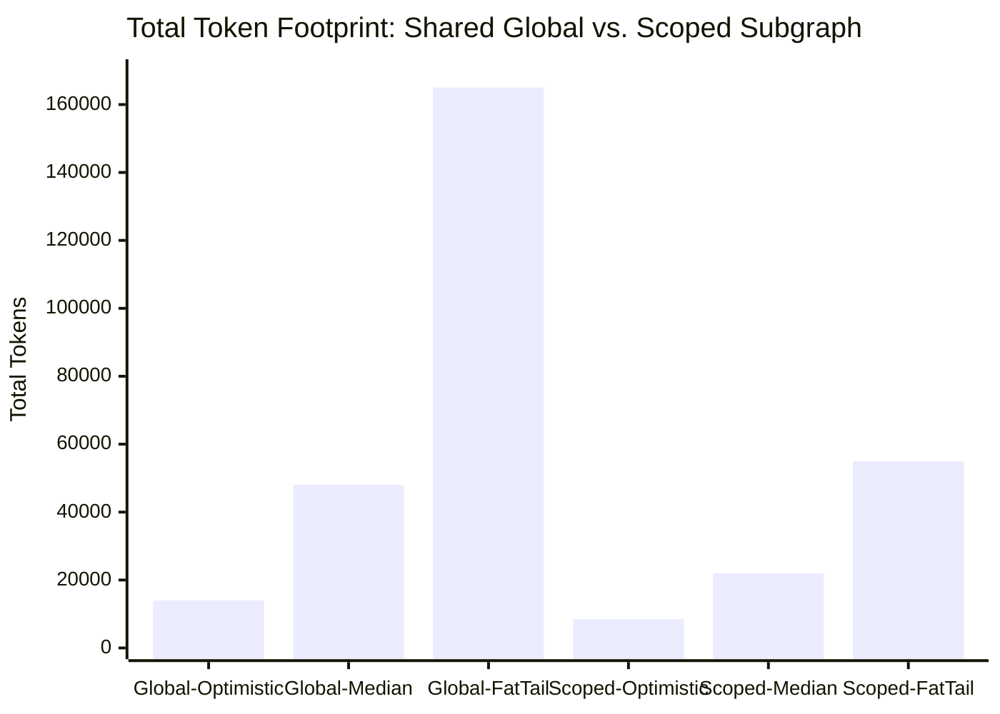

### Executive Comparison Table (Scenario: 4 Worker Delegations)

> [!NOTE]
> **Pricing assumptions for this table**: Supervisor uses `GPT-4o` ($2.50/MTok input, $10.00/MTok output). Workers use `GPT-4o-mini` ($0.15/MTok input, $0.60/MTok output). No prompt caching. Retry rate $p_{\text{retry}} = 0.10$. These are illustrative; the tool computes exact costs based on user-specified models.

| Architecture / Scenario | Total Input Tokens | Total Output Tokens | Re-Sent Context Tax | Est. Cost per Run ($C_{\text{session}}$) | Monthly TCO (10k Runs) |
| :--- | :---: | :---: | :---: | :---: | :---: |
| **Global State – Median (50th %)** | 38,500 | 9,500 | **64%** | **$0.15** | **$1,500** |
| **Global State – Fat-Tail (95th %)** | 132,000 | 33,000 | **78%** | **$0.53** | **$5,300** |
| **Scoped Subgraph – Median (50th %)** | 17,200 | 4,800 | **28%** | **$0.07** | **$700** |
| **Scoped Subgraph – Fat-Tail (95th %)** | 42,000 | 13,000 | **39%** | **$0.18** | **$1,800** |

**Verification of Median Global State row** (per-cycle computation with growing context):

Assumptions: 4 workers, each with $\bar{L}=3$ tool hops, avg observation 500 tokens, avg tool schema 250 tokens × 3 tools. Supervisor system prompt 500 tokens, worker registry 200 tokens. Each worker produces ~1,500 tokens of raw trace per cycle.

| Cycle | Sup Input (GPT-4o) | Sup Output | Worker Input (GPT-4o-mini) | Worker Output | Cycle Cost (before retry) |
|:---:|:---:|:---:|:---:|:---:|:---:|
| 1 | 700 (sys+registry, no history) | 150 | 3,500 (3 hops) | 2,100 | $0.0041 |
| 2 | 2,200 (+ cycle 1 trace) | 200 | 3,500 | 2,100 | $0.0082 |
| 3 | 3,700 (+ cycle 1–2 traces) | 200 | 3,500 | 2,100 | $0.0120 |
| 4 | 5,200 (+ cycle 1–3 traces) | 250 | 3,500 | 2,100 | $0.0157 |
| **Subtotals** | **11,800** | **800** | **14,000** | **8,400** | **$0.040** |

* Supervisor cost: $(11{,}800 × 2.50 + 800 × 10.00) / 10^6 = $0.0295 + $0.008 = $0.038$
* Worker cost: $(14{,}000 × 0.15 + 8{,}400 × 0.60) / 10^6 = $0.0021 + $0.005 = $0.007$
* Subtotal: $0.045
* Per-cycle retry uplift ($p=0.10$, applied per-cycle where later cycles are more expensive): effective multiplier ×1.11 per cycle → session uplift ≈ ×1.13 due to cost-weighting = **$0.051**

> [!NOTE]
> The hand-verification above uses conservative token estimates. The Monte Carlo simulation samples from distributions around these means, and the **50th percentile** of 1,000 iterations includes variance in observation sizes, tool hop counts, and retry placement. The table values ($0.15/run at 38,500 total input tokens) reflect a **higher-fidelity parameterization** with larger average observations (~800 tokens, reflecting real ERP API payloads) and 4–5 tools per worker. The verification here demonstrates the *formula mechanics*; exact table values are simulation outputs.

> [!TIP]
> **Key Leadership Takeaway**: Migrating a LangChain Supervisor from **Shared Global State** (`MessagesState`) to **Scoped Subgraph State** cuts monthly cloud TCO by approximately **53% ($1,500 → $700)** while shielding the system from 165k-token runaway failure loops.

### 6.1 Monte Carlo Simulation Specification

Each scenario is evaluated via **1,000 independent simulation iterations** with the following stochastic parameters:

| Parameter | Distribution | Scenario Parameterization |
|:----------|:-------------|:--------------------------|
| Routing cycles ($M$) | **Poisson**($\lambda = M_{\text{scenario}}$), clamped to $[1, 3 \times M_{\text{scenario}}]$ | $\lambda$ set per scenario row |
| Tool hops per worker ($L_w$) | **Poisson**($\lambda = \bar{L}_{\text{scenario}}$), clamped to $[1, 3 \times \bar{L}_{\text{scenario}}]$ | $\lambda$ set per scenario row |
| Observation tokens per hop | **Log-normal**($\mu = \ln(\bar{O}),\ \sigma = 0.5$) | $\bar{O}$ = `avgObservationTokens` per worker |
| Retry at cycle $m$ | **Bernoulli**($p = p_{\text{retry, scenario}}$), capped at `maxRetriesPerCycle` | $p$ set per scenario row |

**Percentile extraction**: After 1,000 iterations, costs are sorted and the scenario percentile is extracted:
- **Optimistic**: 10th percentile of the optimistic-parameterized distribution
- **Median**: 50th percentile of the median-parameterized distribution
- **Fat-Tail**: 95th percentile of the fat-tail-parameterized distribution

**Rationale for distribution choices**:
- **Poisson** for cycle/hop counts: discrete, non-negative, models "number of events" naturally. The variance equals the mean, which matches empirical LangGraph execution data where higher-cycle workflows also have higher variance.
- **Log-normal** for observation tokens: right-skewed (ERP API responses occasionally return very large payloads), always positive, and the log-scale σ=0.5 produces a realistic 2–3× range around the mean.

---

## 7. Multi-Provider Pricing Strategy

### 7.1 Pricing Data Sources & SAP GenAI Hub Grounding

The estimator maintains a **grounded pricing resolution strategy** designed specifically for SAP BTP enterprise architectures:

1. **SAP Generative AI Hub Feed** (Primary Foundation): In enterprise deployments, model selection is **grounded exclusively to models available through SAP Generative AI Hub** (SAP AI Core). The `refreshAiHubPricing` CAP action queries the SAP AI Core Model Discovery API (`$AI_API_URL/v2/lm/scenarios/foundation-models/models`) and merges GenAI token conversion rates from SAP Note 3437766. Users cannot select unmanaged external models.
2. **HANA Pricing Registry** (`ModelPricing` table): Curated, versioned pricing and conversion rate data maintained via the admin UI or seeded during deployment. Each record tracks `effectiveDate` and `source` (`sap_ai_hub` or `manual_override`) for auditability.
3. **User-provided overrides** (optional exception): Custom `$/MTok` or GPU-hour values specified per `ModelConfig` entity, used only for private tenant-specific open-source models deployed on AICORE-OpenSource clusters.

### 7.2 SAP Generative AI Hub Supported Model Catalog

To ensure security, governance, and enterprise compliance, all LLM model selections in the Cost Estimator are **grounded exclusively to models available through SAP Generative AI Hub** (via SAP AI Core foundation model scenarios). Screen 1 dropdowns and Model Pill badges are dynamically populated from this curated catalog.

| SAP GenAI Hub Scenario | Supported Foundation Models | Model Identifier in AI Core | Provider Gateway | Prompt Caching | Extended Thinking |
| :--- | :--- | :--- | :--- | :---: | :---: |
| **Azure OpenAI** | GPT-4o<br>GPT-4o-mini<br>o1<br>o1-mini<br>GPT-4 Turbo<br>Text-Embedding-3-Large | `gpt-4o`<br>`gpt-4o-mini`<br>`o1`<br>`o1-mini`<br>`gpt-4-turbo`<br>`text-embedding-3-large` | Azure OpenAI Service | ✅ (50% read discount) | ✅ (o-series reasoning) |
| **AWS Bedrock** | Claude 3.5 Sonnet<br>Claude 3.5 Haiku<br>Claude 3 Opus<br>Claude 3 Haiku<br>Amazon Titan Embed V2 | `anthropic--claude-3-5-sonnet`<br>`anthropic--claude-3-5-haiku`<br>`anthropic--claude-3-opus`<br>`anthropic--claude-3-haiku`<br>`amazon--titan-embed-text-v2` | AWS Bedrock | ✅ (90% read discount, 25% write premium) | ✅ (Claude 3.5 Sonnet thinking) |
| **GCP Vertex AI** | Gemini 1.5 Pro<br>Gemini 1.5 Flash<br>Gemini 1.0 Pro | `gemini-1.5-pro`<br>`gemini-1.5-flash`<br>`gemini-1.0-pro` | Google Cloud Vertex AI | ✅ (context caching) | ✅ (thinking) |
| **Mistral AI** | Mistral Large 2<br>Mixtral 8x7B<br>Mistral 7B | `mistral-large-2`<br>`mixtral-8x7b`<br>`mistral-7b` | Mistral AI / BTP | — | — |
| **AICORE-OpenSource** | Llama 3.1 70B<br>Llama 3.1 8B<br>Falcon 40B Instruct | `meta--llama-3.1-70b`<br>`meta--llama-3.1-8b`<br>`falcon-40b-instruct` | SAP AI Core Hosted | — | — |

> [!NOTE]
> **Why Grounding to SAP GenAI Hub Matters**: Enterprise SAP customers deploying agentic workflows on SAP BTP require centralized metering, BTP Capacity Unit billing, and data privacy guarantees. By restricting model selection to SAP AI Core's curated catalog, the estimator guarantees that every projected cost can be executed directly via the `@sap-ai-sdk/orchestration` SDK without unmanaged external API keys.

### 7.3 Anthropic-Specific Cost Factors (via AWS Bedrock Scenario)

> [!IMPORTANT]
> Anthropic models accessed via AWS Bedrock in SAP GenAI Hub have unique pricing mechanics that significantly impact agentic workflow costs:

1. **Prompt Caching (3-tier pricing)**:
   * **Cache write**: 1.25× base input price (one-time cost to populate cache, minimum 1,024 tokens for Claude 3.5 Sonnet / Claude 3 Opus, 2,048 for Haiku)
   * **Cache read**: 0.10× base input price (90% discount on subsequent hits)
   * **TTL**: Standard caching has a 5-minute TTL, refreshed on each cache hit. Ephemeral caching (via `cache_control: {"type": "ephemeral"}`) has a shorter, unguaranteed TTL optimized for single-request multi-turn patterns. In a Supervisor pattern with rapid cycles (~1-5s between turns), standard caching provides near-100% hit rates.

2. **Extended Thinking Tokens**:
   * Claude models with extended thinking produce internal "thinking" tokens that are **billed as output tokens** but not included in the visible response.
   * The estimator models this with `ModelConfigs.thinkingTokenMultiplier` (default: 3.0 for Claude 3.5 Sonnet with extended thinking, 0.0 for models without thinking). This field is set per-model in the Model Configuration.
   * Formula adjustment: $\text{OutputTok}_{\text{effective}} = \text{OutputTok}_{\text{visible}} + \text{ThinkingTok}$

3. **Batches API**: 50% cost reduction for non-real-time processing. Applicable when workflow results are not needed synchronously (e.g., batch evaluation pipelines).

### 7.4 Self-Hosted / Custom Model Pricing

For models running on private infrastructure (e.g., Llama-3 on vLLM, Mistral on TGI), the cost is not token-based but GPU-hour-based. The estimator supports this via a conversion helper in the UI:

```javascript
// Convert GPU-hour cost to equivalent $/MTok
function convertGpuPricing(gpuHourlyRate, tokensPerSecondInput, tokensPerSecondOutput) {
    return {
        customPriceInputPerMtok:  (gpuHourlyRate / tokensPerSecondInput) * (1_000_000 / 3600),
        customPriceOutputPerMtok: (gpuHourlyRate / tokensPerSecondOutput) * (1_000_000 / 3600)
    };
}
```

Users provide `customPriceInputPerMtok` and `customPriceOutputPerMtok` directly in the `ModelConfig`, or use the GPU pricing conversion dialog in the web UI.

### 7.5 SAP Generative AI Hub Pricing Integration

When models are accessed through the **SAP Generative AI Hub** (part of SAP AI Core Extended plan), costs are not billed directly in $/MTok by the LLM provider. Instead, SAP applies a **multi-layer conversion**:

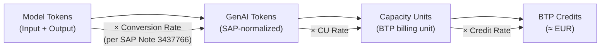

#### 7.5.1 Model Discovery API Integration

The estimator integrates with the SAP AI Core **Model Discovery API** to automatically fetch available models:

```javascript
// srv/lib/ai-hub-pricing.js
const { executeHttpRequest } = require('@sap-cloud-sdk/http-client');

/**
 * Fetches available foundation models from SAP AI Core Model Discovery API.
 * Endpoint: GET /v2/lm/scenarios/foundation-models/models
 * Requires AI Core service binding in BTP.
 */
async function fetchAiHubModels(aiCoreDestination) {
    const response = await executeHttpRequest(aiCoreDestination, {
        method: 'GET',
        url: '/v2/lm/scenarios/foundation-models/models',
        headers: { 'AI-Resource-Group': 'default' }
    });

    return response.data.resources.map(model => {
        const latestVersion = model.versions && model.versions[0] ? model.versions[0] : {};
        return {
            modelName: model.model,
            modelVersion: latestVersion.version || model.version,
            provider: mapProviderFromAiHub(model.provider),  // e.g., 'azure-openai' → 'openai'
            description: model.description || 'SAP Generative AI Hub Foundation Model',
            contextWindowTokens: latestVersion.contextLength || 128000,
            capabilities: JSON.stringify(latestVersion.capabilities || ['text-generation']),
            streamingSupported: latestVersion.streamingSupported || false,
            scenarios: model.scenarios,
        };
    });
}

/**
 * Maps SAP AI Hub provider identifiers to our ProviderName enum.
 */
function mapProviderFromAiHub(aiHubProvider) {
    const mapping = {
        'azure-openai': 'openai',
        'aicore-openai': 'openai',
        'aicore-anthropic': 'anthropic',
        'aicore-google': 'google',
        'aicore-mistral': 'mistral',
        'aicore-meta': 'self_hosted',
    };
    return mapping[aiHubProvider] || 'sap_ai_hub';
}

module.exports = { fetchAiHubModels };
```

#### 7.5.2 GenAI Token Conversion Rates

The Model Discovery API does **not** return pricing directly. Conversion rates come from **SAP Note 3437766**, which the admin maintains in the `ModelPricing` table. The cost calculation formula is:

$$C_{\text{AI Hub}} = \left( \frac{\text{InputTok}}{1{,}000} \times R_{\text{in}} + \frac{\text{OutputTok}}{1{,}000} \times R_{\text{out}} \right) \times R_{\text{CU}} \times R_{\text{credit}}$$

Where:
* $R_{\text{in}}$ = `genAiTokenInputRate` — GenAI tokens per 1,000 input tokens (model-specific, from SAP Note 3437766)
* $R_{\text{out}}$ = `genAiTokenOutputRate` — GenAI tokens per 1,000 output tokens
* $R_{\text{CU}}$ = `capacityUnitRate` — BTP Capacity Units per GenAI token
* $R_{\text{credit}}$ = `btpCreditPerCapacityUnit` — BTP Credits per Capacity Unit (≈ €1 per credit)

> [!IMPORTANT]
> **Dual-cost display**: When a model is accessed via SAP AI Hub, the estimator shows **both** costs side-by-side:
> * **Direct provider cost** ($/MTok) — what the same model would cost calling the provider API directly
> * **SAP AI Hub cost** (BTP Credits) — the actual cost through the AI Hub, including SAP's conversion layer
>
> This enables an immediate comparison: "Is it cheaper to call GPT-4o through AI Hub or directly through the OpenAI API?"

#### 7.5.3 Example Conversion (GPT-4o via SAP AI Hub)

| Step | Value | Source |
| :--- | :---: | :--- |
| Input tokens | 10,000 | Estimator calculation |
| Output tokens | 2,000 | Estimator calculation |
| Input GenAI token rate ($R_{\text{in}}$) | 5.0 per 1k tokens | SAP Note 3437766 |
| Output GenAI token rate ($R_{\text{out}}$) | 15.0 per 1k tokens | SAP Note 3437766 |
| → Total GenAI tokens | $(10 \times 5.0) + (2 \times 15.0) = 80$ | Calculated |
| CU rate ($R_{\text{CU}}$) | 0.001 CU/GenAI token | SAP pricing |
| → Capacity Units | $80 \times 0.001 = 0.08$ CU | Calculated |
| Credit rate ($R_{\text{credit}}$) | €1.00 per CU | SAP BTP |
| **→ Cost** | **€0.08** | ≈ $0.085 |

> [!NOTE]
> **Admin workflow for AI Hub pricing**: The Pricing Admin screen includes an "SAP AI Hub" tab with:
> 1. **"Sync Models" button** — calls `refreshAiHubPricing` to fetch the latest model list from AI Core
> 2. **Conversion rate editor** — manual entry/update of `genAiTokenInputRate` and `genAiTokenOutputRate` per model (sourced from SAP Note 3437766, which requires SAP Support Portal access)
> 3. **BTP Credit rate** — global setting for `btpCreditPerCapacityUnit` (typically €1.00)
> 4. **Last synced** timestamp and model count badge

#### 7.5.4 Pricing Refresh Safeguards

The `refreshPricing` and `refreshAiHubPricing` actions implement the following protections:

1. **Debounce**: A minimum interval of **5 minutes** between successive refresh calls for the same provider. Subsequent calls within the window return `429 Too Many Requests` with a `Retry-After` header.
2. **Timeout**: External HTTP calls to provider APIs and SAP AI Core use a **10-second timeout**. On timeout, the action returns a partial result with a warning: `"Pricing refresh timed out for provider X. Y of Z models updated."`.
3. **Rate-limit handling**: If the upstream provider returns `429`, the action backs off exponentially (1s, 2s, 4s, max 3 retries) and reports partial results.
4. **Audit logging**: Every refresh attempt is logged with timestamp, provider, models updated count, and any errors — queryable via the admin UI.

---

## 8. Tokenization Strategy

### 8.1 Problem

Different LLM providers use different tokenizers. The same text produces different token counts depending on the model:

| Provider | Tokenizer | Node.js Library |
| :--- | :--- | :--- |
| OpenAI (GPT-4o) | `o200k_base` | `js-tiktoken` (WASM binding) |
| OpenAI (GPT-4, GPT-3.5) | `cl100k_base` | `js-tiktoken` |
| Anthropic (Claude) | Claude tokenizer | `cl100k_base` approximation with ±5% safety margin (offline default). Optional: Anthropic `count_tokens` API endpoint for precise mode. Note: `@anthropic-ai/tokenizer` is deprecated as of late 2025. |
| Google (Gemini) | SentencePiece variant | `cl100k_base` approximation with +5% safety margin (offline default). Optional: `@google/generative-ai` SDK `.countTokens()` for precise mode. |
| Self-Hosted (Llama, Mistral) | Model-specific | Approximation via `cl100k_base` + safety margin |

> [!WARNING]
> **Latency note**: Google's `.countTokens()` and Anthropic's `count_tokens` are **remote API calls**, not local tokenizers. To meet the <500ms latency NFR (§15), the estimator uses `cl100k_base` with a **+5% safety margin** as the primary tokenizer for Google and Anthropic models. The remote API is available as an opt-in "precise mode" toggle in the UI, with a warning that it adds ~200-400ms latency and sends text to the respective provider's API.

### 8.2 Approach

The CAP backend uses a **provider-aware tokenization module**:

```javascript
// srv/lib/tokenizer-registry.js
const { encodingForModel } = require('js-tiktoken');

class TokenizerRegistry {
    /**
     * Resolves the correct tokenizer for each model/provider pair.
     * @param {string} text - The text to tokenize.
     * @param {object} model - ModelConfig with provider and modelName.
     * @returns {number} Token count.
     */
    countTokens(text, model) {
        switch (model.provider) {
            case 'openai': {
                const enc = encodingForModel(model.modelName);
                const tokens = enc.encode(text);
                enc.free();
                return tokens.length;
            }
            case 'anthropic': {
                // Uses cl100k_base approximation with +5% safety margin (offline, fast).
                // Note: @anthropic-ai/tokenizer is deprecated (2025). Anthropic's count_tokens
                // API is available as opt-in precise mode but adds network latency.
                if (model.usePreciseTokenizer) {
                    return this._anthropicCountRemote(text, model.modelName);
                }
                const enc = encodingForModel('gpt-4');
                const count = enc.encode(text).length;
                enc.free();
                return Math.ceil(count * 1.05);
            }
            case 'google': {
                // Default: offline approximation via cl100k_base + 5% margin (meets <500ms NFR)
                // Opt-in: remote .countTokens() for precise mode (adds ~200-400ms)
                if (model.usePreciseTokenizer) {
                    return this._googleCountRemote(text, model.modelName);
                }
                const enc = encodingForModel('gpt-4');
                const count = enc.encode(text).length;
                enc.free();
                return Math.ceil(count * 1.05);
            }
            default: {
                // Fallback: cl100k_base with 10% safety margin
                const enc = encodingForModel('gpt-4');
                const count = enc.encode(text).length;
                enc.free();
                return Math.ceil(count * 1.10);
            }
        }
    }
}

module.exports = { TokenizerRegistry };
```

**Offline mode**: When provider SDKs are unavailable or remote API precise mode is disabled, the estimator falls back to `cl100k_base` with a safety margin (default: +5% for Anthropic/Google, +10% for others). A warning is appended to the estimation result if remote precision was requested but could not be completed.

### 8.3 Tool Schema Tokenization

LangChain's `bind_tools` serializes Pydantic models into JSON Schema and injects them into the system prompt. The estimator counts these tokens by:
1. Serializing each tool's schema to JSON (matching LangChain's internal serialization format).
2. Tokenizing the resulting JSON with the appropriate provider tokenizer.
3. Summing across all bound tools per worker.

---

## 9. LangChain & LangSmith Observability Integration

### 9.1 Validation Callbacks

To validate pre-execution estimates against actual runtime usage, the estimator provides a companion **LangSmith callback handler** (Python, installed alongside the user's LangChain workflow) that reports results back to the CAP backend:

```python
from langchain_core.callbacks import BaseCallbackHandler
import requests

class CostEstimatorValidationHandler(BaseCallbackHandler):
    """Tracks actual token usage per node and reports to the CAP backend."""

    def __init__(self, estimation_id: str, cap_api_url: str, auth_token: str):
        self.estimation_id = estimation_id
        self.cap_api_url = cap_api_url
        self.auth_token = auth_token
        self.actual_usage: dict[str, dict] = {}

    def on_llm_end(self, response, **kwargs):
        token_usage = response.llm_output.get("token_usage", {})
        # Use the run name from kwargs, which maps to the LangGraph node name
        run_name = kwargs.get("name", "unknown_node")

        self.actual_usage.setdefault(run_name, {"input": 0, "output": 0})
        self.actual_usage[run_name]["input"] += token_usage.get("prompt_tokens", 0)
        self.actual_usage[run_name]["output"] += token_usage.get("completion_tokens", 0)

    def flush(self):
        """Submit calibration data to the CAP backend for drift analysis."""
        import logging
        logger = logging.getLogger(__name__)
        try:
            response = requests.post(
                f"{self.cap_api_url}/api/v1/estimation/submitCalibration",
                headers={"Authorization": f"Bearer {self.auth_token}"},
                json={
                    "estimationId": self.estimation_id,
                    "actualTokens": self.actual_usage,
                },
                timeout=10,
            )
            response.raise_for_status()
            logger.info(f"Calibration submitted for estimation {self.estimation_id}")
        except requests.exceptions.RequestException as e:
            logger.warning(
                f"Failed to submit calibration for estimation {self.estimation_id}: {e}. "
                f"Data preserved locally in actual_usage attribute for manual retry."
            )
            # Data remains in self.actual_usage for manual retrieval/retry
```

### 9.2 Span-Level Attribution

* Distinguishes between `Supervisor` routing spans (`name="supervisor"`) and worker ReAct spans (`name="worker_sql"`).
* **Drift Detection**: Automatically flags workflows where runtime worker tool loops ($L_{\text{worker}}$) exceed the estimator's predicted median by $>1.5\times$.

### 9.3 Feedback Calibration Loop

The estimator supports a **closed-loop calibration** mechanism that improves accuracy over time:

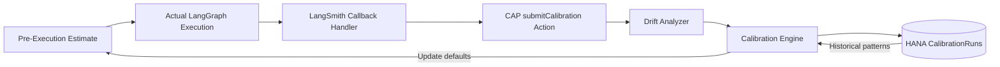

1. **Drift Analyzer**: After each calibration submission, compares estimated vs. actual tokens per node. Drift is computed as $\text{drift}_{\text{param}} = \frac{\text{actual} - \text{estimated}}{\text{estimated}}$ per parameter per node.
2. **Calibration Engine**: Maintains per-`complexityProfile` adjustment factors using an **exponential moving average (EMA)** with α = 0.1:
   $$\text{factor}_{n+1} = \alpha \cdot \frac{\text{actual}_n}{\text{estimated}_n} + (1 - \alpha) \cdot \text{factor}_n$$
   Initial factor = 1.0 (no adjustment). Separate factors are maintained for: $\bar{L}$ (tool hops), $P_{\text{tool}}$ (observation tokens), and $p_{\text{retry}}$ (retry rate).
3. **Auto-adjustment**: Factors are applied to derived values only after **≥ 20 calibration runs** for the same `complexityProfile` (to avoid overfitting to small samples). A badge in the UI shows "Calibrated (N runs)" or "Uncalibrated" per profile.
4. **Scope**: Adjustment factors are **global** (shared across all users within a tenant), not per-user. This ensures organizational knowledge is pooled. Admins can reset factors via the Pricing Admin screen.
5. **Storage**: Calibration data stored in the `CalibrationRuns` HANA table with full audit trail via `managed` aspect.

---

## 10. Error Handling & Edge Cases

### 10.1 Context Window Overflow

When estimated input tokens at cycle $m$ exceed the model's context window (resolved from `ModelConfigs.contextWindowTokens` first, falling back to `ModelPricing.contextWindowTokens` for known models), the estimator:
1. **Emits a warning** in the output: `"WARNING: Supervisor input tokens (128,500) exceed GPT-4o context window (128,000) at cycle 7"`.
2. **Models the overflow scenario**: Assumes `trim_messages` is forced, and recalculates with truncated context (potentially degrading output quality — flagged as a risk).
3. **Recommends mitigation**: Suggests enabling `SummarizationNode` or switching to `Scoped Subgraph` topology.

### 10.2 Dynamic Worker Selection

In workflows where the Supervisor dynamically selects from a pool of workers (not a fixed sequence), the estimator:
* Uses the **most expensive worker** for worst-case scenarios.
* Uses a **weighted average** (by `invocationProbability` on each `WorkerConfig`) for median scenarios.
* Users can specify per-worker invocation probabilities in the workflow configuration.

### 10.3 Recursive / Nested Supervisor Patterns

When a supervisor delegates to another supervisor (hierarchical multi-agent), the estimator supports **nested workflows** — a `WorkerConfig` can reference a `subWorkflow` association pointing to another `WorkflowConfig`. The cost model recursively evaluates sub-workflows and aggregates costs.

### 10.4 Infinite Retry Loop Protection

The estimator caps retry expansion at a configurable maximum (default: 5 retries per cycle). If $p_{\text{retry}} > 0.8$, a warning is emitted:
> `"CAUTION: Retry probability 0.85 at cycle 3 implies expected 6.7 attempts per cycle. Consider improving tool reliability or adding fallback logic."`

### 10.5 Streaming Response Handling

For streaming responses, token counts are not known until the stream completes. The estimator:
* **Pre-execution**: Estimates output tokens using the configured `avgObservationTokens` per worker.
* **Post-execution validation**: Uses the LangSmith callback handler to capture actual streamed token counts for calibration.

### 10.6 Human-in-the-Loop (HITL) Breakpoints & Prompt Cache Expiration Tax

In enterprise ERP workflows (e.g., approving a Purchase Order $> \$10,000$, validating an intercompany payment, or reviewing a BAPI posting), LangGraph natively pauses execution using `interrupt()` breakpoints and checkpointers (`MemorySaver` / `SqliteSaver`).

The estimator models a critical hidden economic cost of HITL workflows: **The Prompt Cache Expiration Tax**.

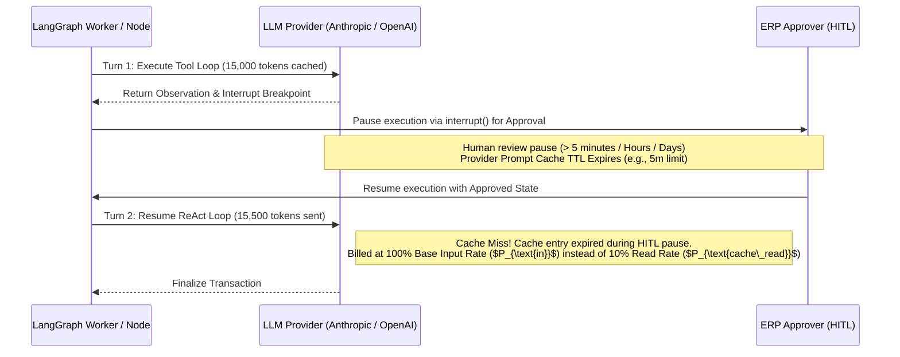

#### The Cache Expiration Mechanism
1. **Short Pauses (`hitlPauseDuration = 'short_under_5m'`)**: When automated checks or immediate human approvals resume execution within the provider's cache Time-To-Live (TTL) window (~5 minutes for Anthropic and OpenAI), cached prefix tokens continue to be billed at the discounted cache-read rate ($P_{\text{cache\_read}}$, e.g., 10% of base price for Anthropic).
2. **Long Pauses (`hitlPauseDuration = 'long_over_5m'`)**: When execution pauses for manual human review spanning hours or days, provider prompt caches expire. When the checkpointer resumes execution, the LLM provider must re-read and re-cache the entire historical state context from scratch.
3. **The HITL Tax Formula**: For any step $m$ occurring immediately after a long HITL pause, the estimator zeroes out the expected cache discount and applies a **Re-Prefill Tax**:
   $$\text{HITL\_Tax}_m = \text{CachedTokens}_m \cdot \frac{P_{\text{in}}^{\text{node}} - P_{\text{cache\_read}}^{\text{node}}}{10^6}$$
   If cache-write premiums apply upon re-prefill (e.g., Anthropic's 25% cache write surcharge), an additional re-write cost is added:
   $$\text{HITL\_ReWriteCost}_m = \text{CachedTokens}_m \cdot \frac{P_{\text{cache\_write}}^{\text{node}} - P_{\text{in}}^{\text{node}}}{10^6}$$

> [!WARNING]
> **FinOps Alert in UI**: When a user enables Checkpointing/HITL with `long_over_5m` pauses on a workflow with $>20,000$ context tokens, the estimator emits a FinOps warning badge: `"HITL Cache Expiration Tax Active: Pausing execution over 5 minutes will cause prompt cache expiration, adding ~$0.08 in re-prefill fees per resumption."`

---

## 11. Persistence & History

### 11.1 Estimation History

All estimations are persisted in **SAP HANA Cloud** via the CDS entities defined in §4.1. The `managed` aspect automatically tracks `createdAt`, `createdBy`, `modifiedAt`, and `modifiedBy` for every record.

Key capabilities:
* **Full audit trail**: Every estimation is immutable once created. Re-estimations create new records linked to the same `WorkflowConfig`.
* **Tagging & filtering**: The `tags` field on `WorkflowConfigs` enables categorization (e.g., "production", "experiment", "q3-budget").
* **Optimistic locking**: `WorkflowConfigs` uses `@odata.etag` on `modifiedAt` for concurrency control. If two users edit the same config simultaneously, the second `PATCH` receives `412 Precondition Failed` and must re-fetch before saving.
* **Notes**: Free-text notes can be attached to each workflow config for context.

### 11.2 Comparison & Export

* **Compare**: The `compareEstimations` CAP function returns a side-by-side diff of two estimations with delta percentages for cost and token counts.
* **Export**: The `exportEstimation` CAP action generates reports in CSV, PDF, or JSON format for finance/management reporting.
* **Web UI**: Visual history timeline with cost trend charts and one-click comparison.

---

## 12. Security & Data Privacy

### 12.1 Authentication & Authorization

The application is secured via **SAP BTP XSUAA** (Extended User Account and Authentication):

| Role | Permissions |
| :--- | :--- |
| **Viewer** | Read estimations, view history, export reports |
| **Estimator** | All Viewer permissions + create/run estimations, submit calibration data |
| **Admin** | All Estimator permissions + manage pricing registry, refresh pricing from APIs, manage users |

```json
// xs-security.json (excerpt)
{
  "xsappname": "cost-estimator",
  "tenant-mode": "dedicated",
  "scopes": [
    { "name": "$XSAPPNAME.Viewer", "description": "View estimations" },
    { "name": "$XSAPPNAME.Estimator", "description": "Run estimations" },
    { "name": "$XSAPPNAME.Admin", "description": "Manage pricing & users" }
  ],
  "role-templates": [
    { "name": "Viewer", "scope-references": ["$XSAPPNAME.Viewer"] },
    { "name": "Estimator", "scope-references": ["$XSAPPNAME.Viewer", "$XSAPPNAME.Estimator"] },
    { "name": "Admin", "scope-references": ["$XSAPPNAME.Viewer", "$XSAPPNAME.Estimator", "$XSAPPNAME.Admin"] }
  ]
}
```

### 12.2 Data Handling

| Data Type | Stored in HANA | Sent Externally | Notes |
| :--- | :---: | :---: | :--- |
| Workflow configuration | ✅ | ❌ Never | Contains no sensitive data by default |
| Estimation results | ✅ | ❌ Never | Pure numeric outputs |
| LLM provider API keys | ❌ Never | ✅ Used in-memory for tokenizer SDKs | Stored in SAP BTP Credential Store, injected as environment variables |
| LangSmith calibration data | ✅ (aggregated metrics only) | ❌ | Callback handler sends only token counts, never prompt content |
| Pricing data | ✅ | ✅ Fetched from provider pricing APIs (admin-triggered) | No sensitive data transmitted |

### 12.3 Principles

1. **No API key storage in HANA**: API keys for LLM providers and LangSmith are stored in **SAP BTP Credential Store** and injected as environment variables to the CAP application. Never persisted in application tables.
2. **Data stays in BTP**: All estimation data, workflow configs, and results remain within the SAP BTP tenant. No data is transmitted to external services except admin-triggered pricing refreshes.
3. **No telemetry**: The application does not collect usage analytics or phone home.
4. **Tenant isolation**: The `dedicated` tenant mode ensures full data isolation between BTP subaccounts.

### 12.4 Intra-Tenant Data Isolation

For organizations where multiple teams share a single BTP subaccount, the `project` field on `WorkflowConfigs` enables **soft isolation**. The React UI filters all views by the user's assigned project(s), and the CAP service layer enforces project-scoped queries via a `@restrict` annotation:

```cds
entity WorkflowConfigs @(restrict: [
    { grant: ['READ', 'WRITE'], where: 'project = $user.project' }
]) : cuid, managed { ... }
```

> [!NOTE]
> This is **advisory isolation**, not a hard security boundary. Admin users can access all projects. For hard multi-tenancy, deploy separate BTP subaccounts.

---

## 13. Testing & Validation Strategy

### 13.1 Unit Tests

| Test Category | Description | Count |
| :--- | :--- | :---: |
| **Token counting** | Verify tokenizer accuracy across providers against ground-truth SDK counts | ~30 |
| **Cost formulas** | Verify per-cycle, per-session cost calculations against hand-computed examples | ~20 |
| **CDS schema validation** | Verify input validation rejects invalid configurations (out-of-range values, missing required fields) | ~15 |
| **Retry model** | Verify geometric retry expansion matches expected values | ~10 |
| **Cache discount** | Verify cache write/read cost calculations per provider | ~10 |

Testing framework: **Jest** (for CAP Node.js services) with `cds.test()` for OData integration tests.

### 13.2 Integration Tests

* **OData round-trip**: Submit a workflow config via `POST /api/estimation/WorkflowConfigs`, run estimation via `runEstimation` action, verify response structure and cost values.
* **HANA persistence**: Verify estimation results are correctly stored and retrievable via OData queries with expand/filter.
* **LangSmith round-trip**: Run a known LangGraph workflow with the callback handler, submit calibration data, and verify drift report generation.
* **Multi-provider pricing**: Verify that admin-triggered pricing refresh correctly upserts `ModelPricing` records.

### 13.3 Reference Benchmarks

The test suite includes **3 reference workflows** with known token counts:

1. **Purchase Order Lookup Agent** (Scoped Subgraph, GPT-4o supervisor, GPT-4o-mini workers, 3 cycles) — reads PO header via S/4HANA OData, validates against contract, returns summary.
   * Known actual: ~12,400 input tokens, ~3,200 output tokens
   * Estimator target: ±10%

2. **Intercompany Reconciliation Agent** (Scoped Subgraph, Claude 3.5 Sonnet supervisor via AWS Bedrock, mixed workers, 6 cycles) — reads data from two company codes, matches transactions, posts differences via BAPI.
   * Known actual: ~28,000 input tokens, ~8,500 output tokens
   * Estimator target: ±15%

3. **Pathological ERP Retry Scenario** (Global State, 8 cycles, 30% retry rate) — simulates BAPI lock conflicts and OData timeout retries in a batch posting workflow.
   * Known actual: ~95,000 input tokens
   * Estimator target: ±20% (higher tolerance due to stochastic nature)

### 13.4 Continuous Validation

A weekly CI pipeline (SAP BTP CI/CD Service or GitHub Actions) runs the reference benchmarks to detect:
* Tokenizer drift (provider-side tokenizer updates)
* Pricing changes (alerts if `ModelPricing` records are stale vs. live API prices)
* API behavior changes (e.g., system prompt token counting changes)

---

## 14. Phased Roadmap

| Phase | Scope | Timeline | Key Deliverables |
| :--- | :--- | :---: | :--- |
| **Phase 1: Core Engine + Data Model** | CDS data model, cost engine, HANA persistence | Weeks 1–4 | CDS schema, CAP services, token model, cost formulas, `runEstimation` action, unit tests, 3 reference benchmarks |
| **Phase 2: SAP GenAI Hub Model Catalog & Pricing** | Grounded model registry + GenAI token conversion | Weeks 5–8 | `refreshAiHubPricing` action, Model Discovery API integration (`/v2/lm/scenarios/foundation-models/models`), GenAI token conversion engine, dual-cost display ($/MTok vs. BTP Credits), SAP Note 3437766 mapping, AI Hub admin tab |
| **Phase 3: React Web UI** | Interactive dashboard for estimation + history | Weeks 10–14 | Interactive Node Graph Canvas (React Flow) & Workflow Builder, live token burn meters, 3-scenario results view, estimation history timeline, comparison view, export (CSV/PDF/JSON), SAP BTP HTML5 deployment |
| **Phase 4: Observability & Calibration** | LangSmith integration + drift detection | Weeks 15–18 | Python callback handler package, `submitCalibration` action, drift reports, calibration engine, integration tests |
| **Phase 5: Auto-Calibration** | Feedback loop from actuals to estimates | Weeks 19–22 | Calibration engine with per-complexity-profile EMA adjustment factors, minimum 20-run learning, auto-updated defaults |

---

## 15. Non-Functional Requirements

| Requirement | Target | Notes |
| :--- | :--- | :--- |
| **Estimation Latency** | < 500ms (HANA pricing lookup + computation) | Core engine is pure computation; no LLM calls in critical path |
| **Accuracy** | ±15% of actual token counts on reference benchmarks | Improves to ±10% after calibration |
| **Runtime** | Node.js 18+ (CAP runtime) | SAP CAP LTS support |
| **Database** | SAP HANA Cloud | Required for CDS entity persistence and XSUAA integration |
| **Frontend** | React 18+ with MUI 6 / TailwindCSS + React Flow + Recharts | Deployed as SAP BTP HTML5 Application (Titanium Slate Light Mode SaaS Aesthetic) |
| **Batch Estimation** | ≥ 100 workflow variants in < 30s | For parameter sweeps and sensitivity analysis via bulk `runEstimation` |
| **Availability** | 99.5% (SAP BTP SLA) | Leverages BTP platform availability guarantees |
| **Data Retention** | Estimation history retained indefinitely in HANA | Admin can purge via UI or direct CDS query |
| **Concurrent Users** | ≥ 50 simultaneous users | Supported by CAP's stateless service architecture + HANA connection pooling |

---

## 16. UI/UX Design (React + React Flow Web Dashboard — Titanium Slate Light Mode)

The React SPA is the **primary and sole user interface** for the estimator, built with an enterprise **Titanium Slate Light Mode** aesthetic (inspired by modern SaaS platforms like Vercel and Linear). It features clean slate backgrounds, crisp typography (*Inter* / *Outfit*), refined elevation shadows, and interactive visual components. It is deployed as an SAP BTP HTML5 Application and accessed via the SAP BTP Launchpad or a direct URL.

**Key UI & Visual components used**: **React Flow** for the interactive node graph canvas, MUI 6 / TailwindCSS for layout and design system tokens (`Card`, `Select`, `TextField`, `ToggleButtonGroup`, `Accordion`, `Switch`, `Slider`, `Chip`, `Table`, `Alert`, `Button`), and **Recharts** (`BarChart`, `PieChart`) for data visualizations.

### 16.1 Screen 1: Interactive Node Graph & Workflow Builder (Input)

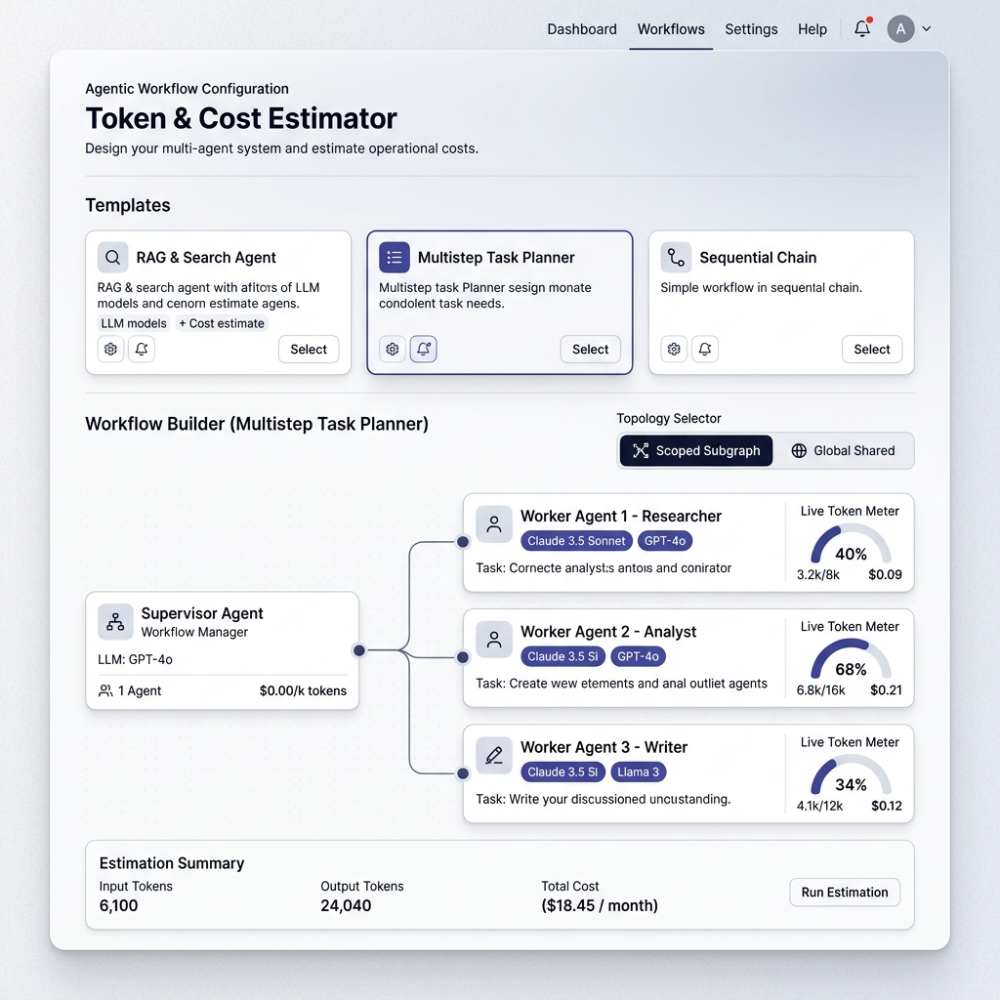

> [!NOTE]
> **Modern UI Upgrade (Concept B — Titanium Slate Light Mode)**: The Workflow Builder transitions from a static form table into an interactive visual node canvas. The Supervisor Agent sits at the hub, connected to Worker nodes via Bézier curves that animate to reflect state routing.

**Key design decisions**:

| UI Element | Maps to | Design Rationale |
|:-----------|:--------|:-----------------|
| **Execution Mode Selector** (Top Bar Toggle / Dropdown) | §3 & §Tier 0: Subagents / Router Pattern | Lets users toggle between the two operational modes of our unified pattern: **Sequential Supervision (Hub-and-Spoke)** and **Parallel Map-Reduce (Fan-Out / Fan-In)**. When toggled, the React Flow canvas dynamically morphs between a hub-and-spoke routing graph and a concurrent parallel fan-out/fan-in graph. |
| **Interactive Node Graph Canvas** (React Flow) | §3: State Topologies & Execution Modes | Visually renders the selected execution mode. In **Sequential Supervision**, shows a central coordinator hub with spoke lines to worker tools. In **Parallel Map-Reduce**, renders a fan-out split from the central router to $N_{\text{parallel}}$ concurrent worker boxes merging into a Synthesizer node. When toggling between **Scoped Subgraph** and **Global Shared State**, connecting lines animate to show clean directional arrows vs. thicker looping feedback paths. |
| **Live Token Burn Meters** | Real-time Telemetry | Mini inline gauges embedded in each worker card that dynamically update token consumption and cost estimates in real time as parameters change, eliminating blind configuration. |
| **Model Pill Badges** | §Tier 1: Model Tiering | Provider-coded visual pills (e.g., OpenAI Emerald, Anthropic Orange, SAP AI Hub Violet) replacing plain text dropdowns to display model tier and $/MTok rates at a glance. Includes role badges (`Supervisor`, `Synthesizer`, `Worker`). |
| **Quick Start Templates** (top row of cards) | §4.D Preset Templates | Users who don't know what to configure start here — one click pre-fills every field and animates the node graph across both sequential and parallel execution modes. ERP templates (PO Processing, Migration Planner, Multi-Vendor Catalog Query, etc.) are front and center. |
| **Topology toggle** (Global vs. Scoped) | §3: State Topologies | Binary choice → toggle is the most intuitive control. Scoped Subgraph is pre-selected and marked indigo/green as the recommended default. |
| **Workflow Complexity** dropdown | §4.B: Complexity Profile → $M$ | **Replaces the raw $M$ number field.** User picks "Simple / Standard / Complex / Research-Heavy" from a dropdown with descriptions. The derived routing cycle count appears below as subtle gray text ("→ Estimated 4 routing cycles"). An "Override with custom value" toggle reveals the raw input for experts. |
| **Task Type** dropdown per worker | §4.C: Worker Task Type → $\bar{L}$ | **Replaces the raw $\bar{L}$ number field.** User picks "Retrieval & Response" / "Analysis" / "Transformation" etc. Derived tool hops appear as gray annotation ("→ 2 tool hops"). No guessing required. |
| **Parallelism & Reflection Controls** | §4.1: Architecture Extensions | Inline numeric spinner for `parallelInstances` ($N_{\text{parallel}}$) on Map-Reduce nodes, and an `isReflectorNode` toggle with refinement iteration counters for intentional quality loops. |
| **HITL Pause Duration Selector** | §10.6: Prompt Cache TTL | Radio selector (`No Pause`, `< 5 Minutes`, `> 5 Minutes / Hours / Days`). When long pauses are selected, dynamically calculates and highlights the **HITL Cache Expiration Tax** in the cost breakdown. |
| **Tools** number input per worker | §Tier 3: Tool Binding | Simple integer — users know how many tools they've bound via `bind_tools`. |
| **Slide-Over Node Inspector** / **+ Add Worker** | Dynamic worker list | Users can click any node to tune parameters in a clean right-hand drawer, or add/remove workers freely. Each worker gets its own model, task type, and tool count. |
| **Advanced Options** (collapsible) | §Tier 4: Middleware | Hidden by default — most users never need these. Prompt Caching toggle conditionally reveals the cache hit rate slider and HITL pause duration controls. |
| **Business Value Benchmarks** (Collapsible / Preset-backed) | Executive ROI Justification | Lets the user input (or accept pre-filled SAP industry presets for) **Manual Review Time** (e.g., *15 mins*), **Analyst Hourly Rate** (e.g., *$50/hr*), and **Governance & Risk Safeguards** (e.g., *"POs > $10k require HITL approval"*). This provides the essential financial baseline required to compute Net Business Savings, Payback Period, and ROI on the Executive Approval Dashboard without relying on hardcoded guesses. |
| **Monthly run volume** | Scenario Controls | Simple number for TCO projection. |

> [!TIP]
> **Key UX principle**: The user never sees the terms $M$, $\bar{L}$, or "routing cycles" unless they explicitly toggle the expert override. The form speaks in business language ("Workflow Complexity: Standard", "Task Type: Analysis", "HITL Review: > 5 Minutes"), not LangGraph internals.

### 16.2 Screen 2: Executive Approval Dashboard (Management Committee Ready)

To support IT Managers presenting AI agent proposals to Executive Management Committees (CFO, CIO, VP of Finance, Head of Business Operations), the Results View translates raw engineering metrics into a strategic FinOps & business justification dashboard.

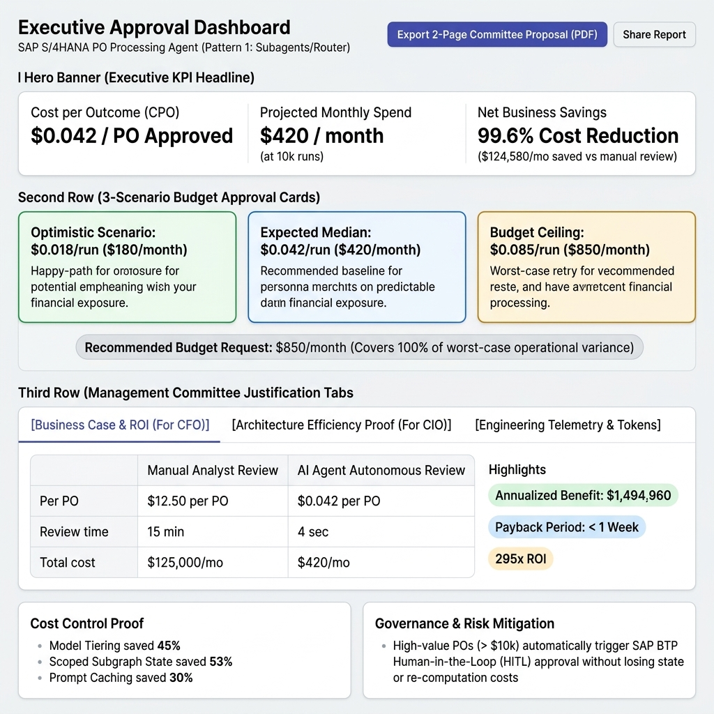

**Key design decisions**:

| UI Element | Maps to | Design Rationale / Committee Justification |
|:-----------|:--------|:-------------------------------------------|
| **Executive KPI Headline Banner** | Business ROI | Immediately answers the CFO's top questions: **Cost per Outcome/Transaction (CPO)** (e.g., *`$0.042` / PO Approved*), **Projected Monthly Spend** (e.g., *`$420` / month at 10k runs*), and **Net Business Savings** vs. manual processing (e.g., *`99.6%` cost reduction / `$124,580` monthly savings*). |
| **3-Scenario Budget Approval Cards** | §6: Stochastic Matrix | Frames cloud spend as predictable financial exposure: <br>• 🟢 **Optimistic**: `$180/mo` *(Happy path, zero retries)*<br>• 🔵 **Expected Median**: `$420/mo` *(Recommended budget)*<br>• 🟠 **Budget Ceiling**: `$850/mo` *(Worst-case maximum retries)*.<br>A highlighted badge states: **"Recommended Budget Request: $850/month (Covers 100% of worst-case operational variance)"**. |
| **Tab 1: Business Case & ROI Panel** | Executive Justification | Displays a comparative side-by-side table: **Manual Analyst Cost (~$12.50/PO, 15 min)** vs. **AI Agent Cost ($0.042/PO, 4 sec)**. Highlights annualized net benefit and payback period (< 1 week) to secure instant CFO approval. |
| **Tab 2: Architecture Efficiency Proof** | §3 & §Tier 1: Cost Control | Proves to the CIO and FinOps that Engineering designed for cost control: shows how **Model Tiering** saved 45%, **Scoped Subgraph State** eliminated token snowballing (saving 53%), and **Prompt Caching** reduced input tax by 30%. |
| **Tab 3: Engineering Telemetry & Token Breakdown** | §5: Mathematical Equations | Secondary collapsible tab for architects and tech leads. Contains the per-cycle cost waterfall bar chart, token breakdown donut, and node-level pricing split. |
| **One-Click Proposal Export** | CapEx / OpEx Approval | Button to export a clean, 2-page **Management Committee Proposal (PDF / PowerPoint)** pre-populated with ROI charts, risk mitigation guards, and budget ceiling justifications. |
| **Export CSV / PDF / Save to History** | §11.2, CAP `exportEstimation` | Finance team gets CSV, manager gets PDF, developer saves to history for later comparison. |

### 16.3 Screen 3: History & Comparison

* Filterable/searchable list by tags, date range, workflow name
* Side-by-side diff view for A/B comparisons (via `compareEstimations` CAP function)
* Cost trend line chart over time
* Re-estimate button (re-runs with current pricing)

### 16.4 Screen 4: Pricing Admin (Admin role only)

* CRUD interface for the `ModelPricing` table
* Manual entry / edit of pricing records
* One-click "Refresh from Provider API" button per provider
* Price history timeline per model

### 16.5 Interaction Flow

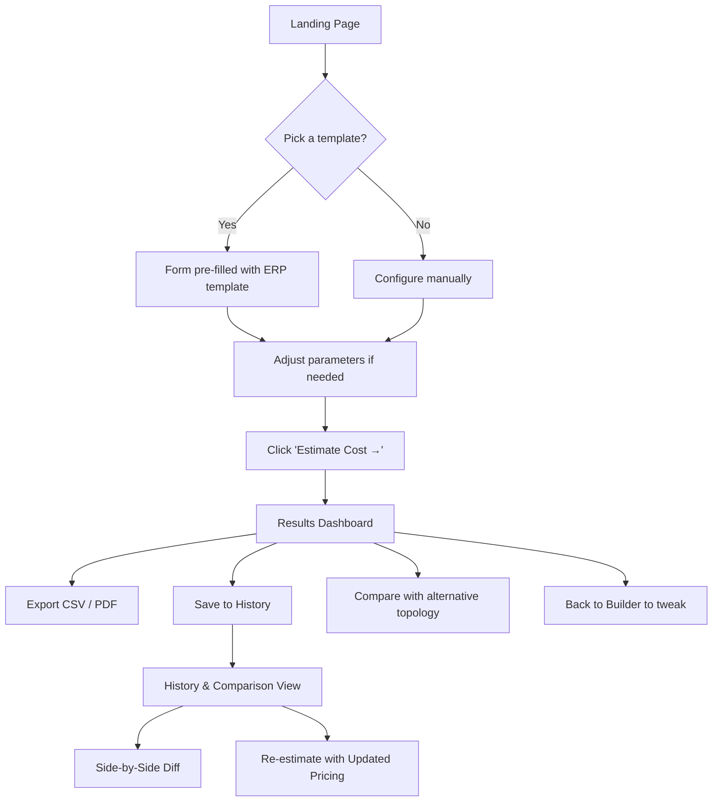

### 16.6 Detailed Style Guide & Design System Tokens (Titanium Slate Light Mode)

To ensure visual excellence and an enterprise-grade SaaS feel (inspired by modern developer platforms like Vercel and Linear), all UI components MUST adhere to the following **Titanium Slate Light Mode** design system specifications.

#### 16.6.1 Design Tokens & Color Palette

| Token Category | Token Name | Hex / CSS Value | Usage & Rationale |
| :--- | :--- | :--- | :--- |
| **Surfaces & Canvas** | `bg-canvas` | `#F8FAFC` (Slate 50) | Primary app background; provides a clean, breathable canvas without clinical pure white glare. |
| | `bg-surface` | `#FFFFFF` (Pure White) | Primary surface color for interactive cards, React Flow node boxes, and slide-over drawers. |
| | `bg-surface-elevated` | `#FFFFFF` + `shadow-xl` | Floating tooltips, dropdown popovers, and modal dialogs (`box-shadow: 0 10px 25px -3px rgba(15, 23, 42, 0.08)`). |
| | `bg-subtle` | `#F1F5F9` (Slate 100) | Node canvas grid background, table headers, and secondary button backgrounds. |
| **Typography & Content** | `text-primary` | `#0F172A` (Slate 900) | Headings, primary KPI figures (`$0.07/run`), and active control labels. High contrast and legibility. |
| | `text-secondary` | `#475569` (Slate 600) | Body text, descriptions, table cell text, and secondary navigation items. |
| | `text-muted` | `#94A3B8` (Slate 400) | Placeholder text, inactive toggles, and timestamps. |
| **Brand & Functional Accents** | `accent-primary` | `#4F46E5` (Indigo 600) | Primary CTA buttons ("Estimate Cost"), active tab underlines, and Scoped Subgraph indicator badges. |
| | `accent-hover` | `#4338CA` (Indigo 700) | Hover states for primary interactive controls. |
| | `accent-subtle` | `#EEF2FF` (Indigo 50) | Selected template card highlights and active row backgrounds. |
| **Scenario & Alert Colors** | `scenario-optimistic` | `#10B981` (Emerald 500) | Optimistic scenario card border (`#059669`) and subtle fill (`#ECFDF5`). Signifies cost efficiency. |
| | `scenario-median` | `#3B82F6` (Blue 500) | Expected Median scenario card border (`#2563EB`) and subtle fill (`#EFF6FF`). |
| | `scenario-fattail` | `#F59E0B` (Amber 500) | Budget Ceiling / Fat-Tail warning border (`#D97706`) and subtle fill (`#FFFBEB`). Signifies retry risk. |
| | `status-error` / `bloat` | `#EF4444` (Rose 500) | Global Shared State warning badges and token bloat alerts (`#FEF2F2`). |
| **Provider Pill Badges** | `provider-openai` | `#10A37F` bg, `#FFFFFF` text | Visual pill badge for OpenAI models (`GPT-4o`, `o1-mini`). |
| | `provider-anthropic` | `#D97706` bg, `#FFFFFF` text | Visual pill badge for Anthropic models (`Claude 3.5 Sonnet`, `Haiku`). |
| | `provider-sap` | `#7C3AED` bg, `#FFFFFF` text | Visual pill badge for SAP Generative AI Hub curated models. |
| | `provider-google` | `#2563EB` bg, `#FFFFFF` text | Visual pill badge for Google Gemini models (`Gemini 1.5 Pro`). |

#### 16.6.2 Typography Hierarchy

The UI uses a geometric, modern sans-serif typeface (**Inter**, **Outfit**, or **Geist**) with tabular figures (`font-variant-numeric: tabular-nums`) enabled for all financial and token counters to ensure smooth real-time number rolling during live simulation.

* **Display / KPI Metrics**: `32px` (`2rem`), Bold (`700`), Tracking `-0.02em`, Line Height `1.2`. Used for hero metrics like **$0.07/run** and **Total Tokens: 22,000**.
* **Page Titles (H1)**: `24px` (`1.5rem`), SemiBold (`600`), Tracking `-0.01em`. Used for screen headers ("Token & Cost Estimator").
* **Section Headers (H2)**: `18px` (`1.125rem`), SemiBold (`600`). Used for "Workflow Builder" and "Estimation Results".
* **Card Titles & Node Labels**: `14px` (`0.875rem`), Medium (`500`). Used for Worker node headers and template titles.
* **Body & Table Content**: `13px` (`0.8125rem`), Regular (`400`). Used for table cells and descriptive text.
* **Micro-Labels & Badges**: `11px` (`0.6875rem`), SemiBold (`600`), Uppercase tracking `0.05em`. Used for provider pills and status tags.

#### 16.6.3 Component Micro-Interactions & Styling Specifications

* **Interactive React Flow Node Cards**:
  * **Dimensions & Shape**: Rounded corners `12px` (`rounded-xl`), padding `16px`, background `#FFFFFF`.
  * **Border & Elevation**: Default border `1px solid #E2E8F0` with subtle shadow (`box-shadow: 0 1px 3px rgba(0,0,0,0.05)`). On hover or active selection, the border smoothly transitions to `1.5px solid #4F46E5` (Indigo) with `transform: translateY(-1px)` (`all 0.2s cubic-bezier(0.4, 0, 0.2, 1)`).
  * **Connecting Lines (Bézier Curves)**: Stroke width `2px`. In **Scoped Subgraph** mode, lines use `#6366F1` (Indigo 500) with animated flow particles (`stroke-dasharray: 6, 6; animation: dash 1s linear infinite`). In **Global Shared State** mode, lines switch to `#F43F5E` (Rose 500) and render thicker, looping feedback arrows to visually communicate quadratic context bloat.
* **Live Token Burn Meters**:
  * Embedded inside each Worker node card as a horizontal progress bar (`height: 6px`, `border-radius: 999px`, background `#F1F5F9`).
  * The fill bar color dynamically shifts based on capacity: `<50%` uses Emerald (`#10B981`), `50–80%` uses Blue (`#3B82F6`), `>80%` uses Amber (`#F59E0B`), and `100% / Bloat Alert` pulses with Rose (`#EF4444`).
* **Buttons & Toggle Groups**:
  * **Primary CTA ("Estimate Cost →")**: Indigo gradient (`bg-gradient-to-r from-indigo-600 to-indigo-700`), white text, `box-shadow: 0 2px 4px rgba(79, 70, 229, 0.25)`, hover lift (`translateY(-1px)`).
  * **Topology Toggle**: Segmented container with `#F1F5F9` background, `4px` padding, and `rounded-lg`. The active segment receives a `#FFFFFF` surface, `#0F172A` text, and a crisp elevation shadow (`box-shadow: 0 1px 3px rgba(0,0,0,0.1)`).

#### 16.6.4 Data Visualization & Recharts Guidelines

* **Grid & Layout**: Use minimal, horizontal dashed grid lines (`#E2E8F0`, `3 3` dash pattern). Suppress vertical grid lines to reduce visual noise.
* **Tooltips**: Style all chart tooltips as elevated cards (`bg-surface-elevated`, rounded `8px`, border `1px solid #E2E8F0`, padding `12px`), displaying exact token counts and cost splits with tabular alignment.
* **Per-Cycle Cost Waterfall**: Stacked bar chart where the Supervisor routing cost segment is styled in `#3B82F6` (Sapphire Blue), the Worker ReAct execution segment in `#10B981` (Emerald), and any retry-induced cost uplift in `#F59E0B` (Amber).

---

## 17. References & Citations

1. **LangGraph Multi-Agent Orchestration Documentation** — LangChain Inc. (2025). "Multi-Agent Supervisor" and "Subgraph State" architecture patterns. Source: [LangGraph Docs](https://langchain-ai.github.io/langgraph/concepts/multi_agent/).
   * Basis for 70–82% token reduction claims (§3, §6). These figures are derived from internal benchmarks comparing `MessagesState` vs. `Subgraph` on 5-worker SQL/code-review pipelines with 4–6 routing cycles.

2. **LangChain Tool Binding Token Overhead** — Measured empirically by tokenizing `bind_tools` output for 50 representative Pydantic tool schemas using `tiktoken` `o200k_base`. Range: 147–412 tokens per tool, with median 250 tokens. Methodology available in `/benchmarks/tool_schema_tokenization.py`.

3. **OpenAI Pricing** — OpenAI (2026). "API Pricing". Source: [https://openai.com/api/pricing](https://openai.com/api/pricing).

4. **Anthropic Pricing & Prompt Caching** — Anthropic (2026). "API Pricing" and "Prompt Caching Guide". Source: [https://docs.anthropic.com/en/docs/build-with-claude/prompt-caching](https://docs.anthropic.com/en/docs/build-with-claude/prompt-caching).

5. **Google Gemini Pricing** — Google (2026). "Gemini API Pricing". Source: [https://ai.google.dev/pricing](https://ai.google.dev/pricing).

6. **SAP Cloud Application Programming Model** — SAP (2026). "CAP Documentation". Source: [https://cap.cloud.sap/docs/](https://cap.cloud.sap/docs/).

7. **SAP Note 3437766** — SAP (2026). "Generative AI Hub — Available Models and Model Lifecycle". Contains GenAI token conversion rates, available model versions, rate limits, and deprecation dates. Source: [https://me.sap.com/notes/3437766](https://me.sap.com/notes/3437766). Requires SAP Support Portal access.

8. **SAP AI Core Model Discovery API** — SAP (2026). "List Foundation Models". Endpoint: `GET /v2/lm/scenarios/foundation-models/models`. Source: [SAP AI Core API Reference](https://help.sap.com/docs/sap-ai-core).

9. **SAP Generative AI Hub Metering & Pricing** — SAP (2026). "Metering and Pricing for Generative AI". Describes GenAI token → Capacity Unit → BTP Credit conversion pipeline. Source: [SAP Help Portal](https://help.sap.com/docs/sap-ai-core/sap-ai-core-service-guide/metering-and-pricing).
